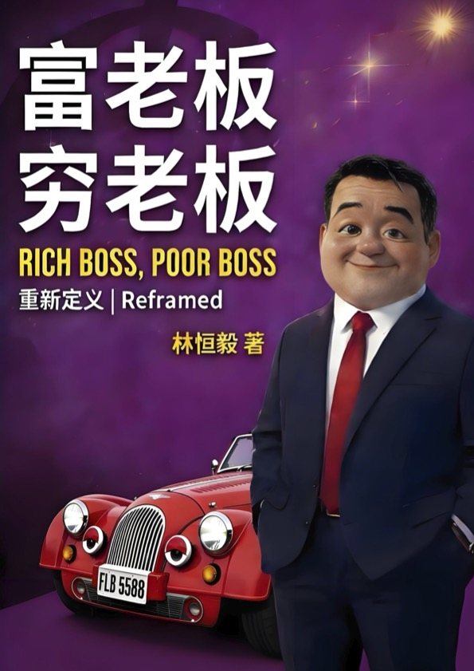
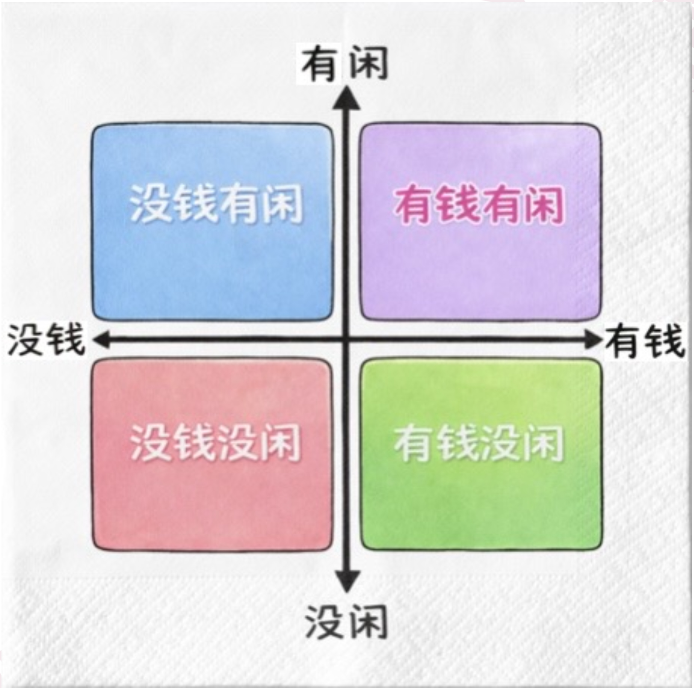
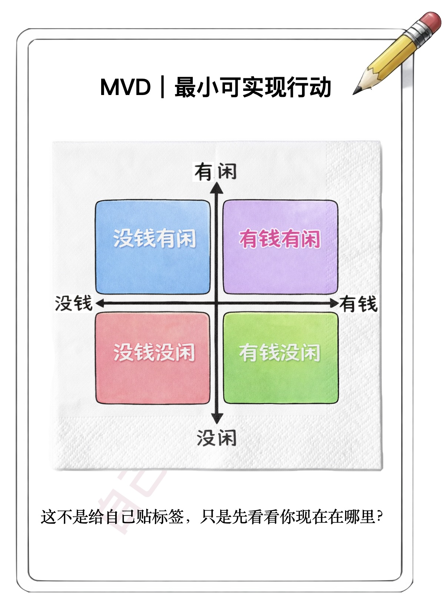
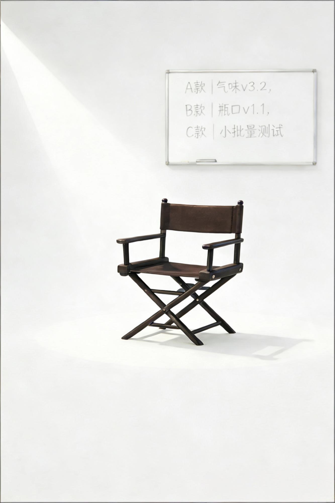

《富老板，穷老板》 RICH BOSS, POOR BOSS
重新定义｜Reframed

# 作者序｜为什么我决定在今天重写《富老板，穷老板》
我写过两个版本的《富老板，穷老板》。
第一个版本，很“完整”。它给出了方法、工具、路径，告诉你如何变得有钱、有闲。但我没有公开出版它。只在很小的范围内，送给一些老客户。因为随着接触的老板越来越多，我越来越清楚地意识到一件事：
答案，并不会直接带来结果。

赚到钱，却没走远的老板
过去这些年，我有机会近距离参与很多企业的成长。
有的老板，能力很强、反应极快；有的公司，在很短时间内达到很大规模；有的团队，方法、工具、资源一样不缺。但当规模上升、问题叠加、复杂性出现之后，结果却开始分化。
有人继续成长，有人停在原地，有人开始反复掉进类似的问题里。
同样的商业模式，截然不同的经营成果。同一套解决方案，有人迅速落地，有人却从未开始。就像同一台车子，不同的驾驶员，最终的成绩天差地远。
这让我不得不面对一个事实：
企业真正的增长上限，往往不是由方法、工具或资源决定，老板和团队所能驾驭的复杂性高低，才决定企业的增长上限。
赚钱变快了，走错路也变快了
如果你认真看现在的商业环境，会发现一个很吊诡的变化：
工具越来越强大，增长速度越来越快，成功案例越来越多。但与此同时，老板更累了，组织更脆弱了，系统失控的速度也更快了。
电商、短视频、直播、AI、多平台协作，都让“短期上规模”变得极其容易。可一旦方向错了，其他环节没跟上：供货不及、质量失控、客诉退货、费用飙升、营增利减、团队内耗……
系统会比你想象中更快地把错误放大。就像旧地图无法通往新大陆，老版本的操作系统，也无法下载并运行最新的超级应用。
问题不是努力够不够，问题是决策到底有没有效。
我开始怀疑：我们是不是在用旧的标准谈“富老板”
过去我们谈富老板，很直觉：钱多不多，人忙不忙？自由不自由，轻松不轻松？
但在今天，这些指标已经不合时宜了。因为我看到太多老板：努力却赚不到钱；钱是赚到了，时间却被系统吃掉；到处学习，却越来越没有方向；更闹心的是，被市场、被自己建立的公司和团队反过来牵着走。
那一刻我意识到，我们需要重新定义“富老板”。
在复杂多变的世界里，我这样理解“富老板”
对我来说，一个真正的富老板，不仅是拥有更多的结果，更重要的是，必须具备一种能力：
一种在复杂多变的世界里，能够持续做出有效决策的能力。
这种能力，体现在三个方面：
真正的富老板，具备因果判断力，不会被短期“看起来很赚钱”的机会绑架；
真正的富老板，知道在什么前提下可以选择提速，什么时候又该先慢下来；
真正的富老板，懂得拆解问题背后的结构，分析并找到真问题，也就是说，能够在必要的时候，升级系统，而不是被旧系统逼着到处救火。
更重要的是，他能感知到：现在在哪里，接下来该往哪儿走。而金钱和时间，只是系统张力长期作用后的显影结果。
这一次，我选择说一个关于系统的故事
每个创业者都是一本书，他们让我们的生活更便利，他们是社会进步的驱动力，并且在迈向共同富裕的道路上扮演至关重要的角色。陪伴和帮助这些创业者和准创业者们的过程，让我充满激情与活力，这就是第二个版本《富老板，穷老板》的起点。
这一回，我不再试图直接给你答案。我只想带你一起见几个人：
一个赚得越来越多，却差点输光的人；
一个什么都有了，却开始怀疑方向的人；
一个看起来已经赢麻了，却越来越累的人。
他们是我曾经服务过上千名老板的真实缩影；当然，也包括我自己亲身的经历。他们都很认真，也都走在不同的路上。
我想邀请你看的，不在于他们有多么成功，是去看他们在什么阶段，遇到了什么样的系统，他们又是如何应对的。
这不是一本适合所有人的书
如果你现在：一心只想赚钱；急着找一个立刻见效的方法；希望有人直接告诉你“该怎么做”。那你可能暂时不需要这本书。
但如果你已经开始隐约感觉到：“为什么我已经这么努力了，却得不到自己想要的结果。”那么，这本书可能会带给你一些启发，并且陪你走一段路。
最后的话
我重写《富老板，穷老板》，并不是为了制造一个新的成功概念。我是想确认一件事：
在这个变化速度远远超过经验和直觉的时代，我们是否还拥有，让自己与企业一起进化的勇气。
在混乱复杂的环境中，能够持续做出有效的判断并不容易。如果你读完这本书，能多一点清晰的思考，多一点勇气采取行动，愿意为自己的决策负责任。
那就够了。咱们路上见。

# 前言
在商业世界中，真正困难的问题，往往并不是如何“做”，而是“如何判断做或不做”。大多数重要决策并非发生在信息充分、条件清晰的理想状态下，而是在时间受限、信息不完整、利害关系交织的压力环境中完成的。正是在这些情境中，人们最容易依赖经验、惯性或直觉，而忽略判断本身正在发生偏移。
许多基于直觉所做出的决策，在当下看起来合理，甚至符合常规，但在一段时间之后却累积出不利的结果。问题并不总是出在能力或努力上，而是出在决策时所依据的判断方式并未随着环境变化而更新。这时候，判断失误的原因往往是结构性的，而非偶然的。
《富老板，穷老板》关注的正是这种结构性的问题。它并不试图提供一套放之四海皆准的答案，而是把注意力放在一个更基础、也更容易被忽略的层面：人在复杂情境中是如何做出判断的，以及这种判断方式如何在过程中导致不同的走向。所谓“穷”与“富”、“忙”与“闲”，并不只是结果的标签，而是判断系统是否需要升级或进化的外在体现。
与其说这是一本“教你如何成为富老板”的答案之书，不如说它更像一部用于校准决策的觉察之书。这里所谓“校准”，并非指某个具体的步骤或公式，而是一种可反复使用的检查视角：
当你面对选择、分歧或不确定性时，它把你的注意力从表面的选项，拉回到决策本身——你正在基于什么依据做决定？隐藏了哪些前提，忽略了哪些关键变量？你是否充分考虑到所有的选择，还是被噪音干扰，遮蔽了某些选项？更重要的是，你是不是在系统张力的作用下，被逼着做决策？
它不是一本流程手册，也不是成功经验的总结。书中不会要求你照着某个步骤执行，也不会承诺只要遵循某种做法就能获得确定结果。它更像一面镜子：让你在故事里看见自己，并在复杂环境里检查自己的判断前提是否仍然成立。换句话说，这本书并不替你做决策，而是帮助你在做决策之前，看清自己正在使用的判断模式。
正因为如此，这本书并不强调一次性读完的体验。它更适合在不同阶段、不同问题面前被多次使用。你可以把它当作一本随手翻阅的工具书，在遇到类似处境时回到相关章节；也可以在重要决策之前，重新阅读某些情节，用来对照和审视当下的决策路径。书中的价值，并不在于记住多少内容，而在于在关键时刻是否能想起并派上用场。
本书保留了寓言式的结构，但采用较详细的商业小说手法来呈现。部分行业与场景写的“既具体、又留白”，是为了让你更容易代入；你要带走的不是行业做法，而是决策模式。书中刻意保留了足够的空间，让读者能够把自己的现实处境投射其中。这种投射本身，就是决策校准过程的一部分。故事不会替你做选择，但会不断贴近你正在使用的行为逻辑。
在实际使用中，这本书往往在几类情境下发挥作用。
例如，当你需要在扩张与收缩之间做出选择，却发现两种选项都有充分理由；当你面对短期压力与长期投入的冲突，难以判断何时该坚持、何时该调整；又或者，当你意识到自己正在重复过去的决策模式，却无法确认环境是否已经发生变化。这些情境的共同点在于：问题不在于“选项不足”，而在于判断依据本身是否仍然可靠。本书正是为这些反复出现、却难以被简单化处理的时刻而存在。
最后需要提醒的是，这并不是一本“快速见效”的书。它无法替代实践，也无法完全消除风险。它所提供的，是一种在不确定环境中帮助你提高能见度的检测机制，帮助你减少被惯性和噪音牵着走的概率。很多时候，决策质量的提升，并不来自更激进的行动，而是来自在行动之前，多一次对判断基础的核查。
因此，阅读这本书时，你不必急于寻找结论。相反，更值得观察的线索是：在某些情节中，你是否会下意识地认同某个角色的选择；在另一些地方，你是否会产生犹豫或不适。这些反应本身，往往比故事的走向更重要。它们可能在提示你，在类似情境中，你可能也会做出相同的判断和选择。读的时候，你只需注意一件事：角色在关键时刻是如何做决策的？
如果你期待的是一个明确的答案、一个可以直接套用的方法，那么这本书可能无法满足你的需求。但如果你正在寻找一种方式，帮助自己在复杂而多变的商业世界中，持续做出有效的决策，跨越不同阶段，实现系统性增长，那么这本书正是为此而写。

# 序幕｜遇见
## 第一场｜办公室
那天中午，办公室的灯比平常亮得久了一点。开始有同事准备下楼去吃饭，走廊慢慢安静下来，可笔记本的桌面反而更吵，消息像潮水一样顶着时间往上涌：客户的语音、团队群里的@、财务发来的表格、IT部门发过来的截图、还有一条“能不能今天就定下来”的催促。
年轻的创业者把外卖盒打开又盖上。筷子在手里转了一圈，还是没夹起来。胃在提醒他“你该吃了”，却有另一个更强的声音在提醒他“你还不能停下来”。
他盯着手表的时间，12:17，像盯着一个不断跳动的倒计时。明明没有人在说：“你必须现在解决”，可所有问题都在用同一种语气说：现在、立刻、马上。
他切换窗口，改一份交付文档，顺手又回一条信息：“好的，我看一下。”这句“我看一下”是他的自然反应，像呼吸一样自然。可他心里知道，这不是看一下——这是再把一个小火苗接到自己身上。
下一秒，电话响了，他接起，听了三句就开始点头：“嗯，明白……你先别急……我来处理。”挂断后，他把电话放下，手指放在键盘上，像在确认些什么。
桌面的表格上写着几行字：问题 / 原因 / 责任人 / 解决方案。打到“解决方案”这里，突然觉得它像一个破水桶——你往里加得越快，它越快漏出去。因为问题是一串一串的；像一片在燃烧的森林，你扑灭一个角落，另一个角落就开始冒烟。
他合上电脑看向窗外，今天天气不算晴朗，只有偶尔从云层透出的一缕阳光。
上午其实不算特别忙，准确地说，是忙完了，却不知道忙了什么。邮件回了，电话打了，会议也开了。几个问题被暂时解决了，但心里那股不安还在。像是把水舀出了船，却不知道船为什么一直进水。
那种“我是不是应该缓一下”的念头刚冒出头，就会被下一条消息压回去：服务商说设备延期，运营说活动要提前，团队说新同事还没上手。每一条都像是合理的。他忽然有点恼火，却又不知道该对谁恼火——对人不对，对自己也不对。
他把外卖盒推到一边，重新掀起电脑屏幕，刻意挺直腰杆，像给自己上了一个看不见的发条。手指继续敲，敲得很稳，表情也很淡定。只有他自己知道，这种稳不是从容，是刻意控制；不是笃定，是被迫维持。
手机被压在桌面最底下，他原本只想扫一眼——手机却在这时轻轻震了两下。
屏幕亮起：
13:30｜投资人
地点：老城区××路××号
备注：大学同学介绍——“不是你想的那种投资人，不用准备BP”
他盯着“投资人”三个字，喉咙像被什么卡了一下。说不重视是假的——他确实需要资金，也需要一个能暂时“摆脱”混乱的机会。更何况是老李那种少见的认真口气：先是铺垫了很久，说这人不按套路、不看PPT、也不会说漂亮话；最后才丢下一句：“你去见见就知道了。”
可现实又把他的注意力硬生生拉回屏幕桌面：一排未读消息像在排队等他检阅。他看了一眼时间——12:21。离出发只剩半多小时。
他把手机扔回桌面，深吸一口气，像把某种期待先放进抽屉里。他太清楚：只要这堆火还在烧，他就连走出办公室都得带着火星。
手指重新落回键盘，心里却出现一丝不一样的念头：“下午，不知道会怎么样？”
## 第二场｜咖啡馆
最后把电脑合上的那一下，比平常更用力一点，像是在跟屏幕里那堆“必须马上处理”的东西切割。外套刚搭到背上，手机又震：供应商发来一段语音，十几秒，他没点开，只回了四个字——“晚点回复”。
电梯下到负一楼时，他才意识到自己手心是湿的。不是因为见投资人紧张，更像是一路被追着跑，突然可以停下来喝口水后的那种生理反应。
车开出地下停车场。导航显示到老城区要接近四十分钟。他脑子里自动弹出一串“如果”：“如果迟到了，对方会说什么？如果对方真感兴趣，会问什么？要不要补材料？如果要改天再约一场？如果……。”
他一边想，一边又觉得好笑——备注明明写着“不用准备BP”，可他怎么可能真的不准备？他准备的不是PPT，是一种防御：准备解释、准备证明自己像个“值得被投的项目”。
车窗外的楼房越来越旧，招牌越来越杂乱，路面也开始变窄起来。导航提示“右转，即将到达目的地”。他慢了一拍才把车拐进一条小巷，整条巷子像是被时代遗忘的折页：斑驳的墙面、褪色的字、几家还在营业的小店。
拐过弯，看见一块复古的金属招牌——Jazz Kim Cafe。字母有些氧化，边上还起了锈，像是故意不打磨，任由时间留下痕迹。他下意识笑了一下：“也就只有老城区，才容得下这种像活在上个世纪的咖啡馆。”
开门进去的一瞬间，鼓刷声像灰尘一样落在肩上。室内不大，灯光压得很低，吧台后面咖啡机在轻轻吐气。背景音乐很耳熟——不是他能叫出名字的熟，是那种“好像以前听过”的熟。低音贝斯稳稳地走着，钢琴像在旁边托底，小号的声音不急不躁，像一句淡淡的“欢迎光临”。他站在门口，忽然有点不确定自己该走快点还是走慢点。
他环顾了一下店里。靠边窗的位置，一个男人已经坐在那儿了。没在看手机，桌上也没有笔记本电脑。只有一杯咖啡，和一张黑胶唱片的封套，边角有点旧。
年轻创业者走到桌旁，压着声音：“你好，不好意思……老李让我来找你。”
男人抬头，看见他，笑了一下。不是那种公关式的笑。更像是你迟到了五分钟，而对方其实并不在意。
“你就是老李提到的那位吧。”男人站起来，伸手。声音不大，也不急。
“路上还顺利吗？老城区路比较小，不大好找。”
他点点头。刚坐下，服务生过来。男人：“美式，还是拿铁？”他：“跟你一样吧。”
背景音乐在空气里流淌，尴尬悄悄地浮上来，两个男人都知道，但谁也没急着把它压下去。
他低头，看见桌上的唱片封套，像抓到一个可以开口的话题：“正在放这张吗？好像……在哪里听过。”
男人没立刻回答，只侧过头，又听了一会儿，音乐停顿。
“嗯。应该很多人都会有这种感觉。”
男人说这句话的时候，没有解释，像是在陈述一个不需要证明的事实。等一段钢琴旋律响起，又用手指点了点那张封套，补了一句：“《So What》，Miles Davis。”
他顺着男人手指的方向，封套上写着《Kind of Blue》，点了点头。他其实并不是真的认识，只是觉得这几个字眼熟，似乎在某个短视频的配乐栏里看到过。
咖啡馆里没有其他人在说话。
## 第三场｜偶然
低音贝斯先响起来。
噔噔~~ —— 噔噔~~。
两段音。间隔很大。像是在试探空间。
男人点了点桌面，像在数拍。
“这首歌不是从主角开始的。”
年轻创业者抬起头。
“是贝斯，他先出来，不是为了表现，是为了把地板铺好。”
贝斯和钢琴继续在重复那两段音。
不急，也没什么变化。
“如果现在就想加点什么进去，会显得很蠢。”
男人说得很轻，像是在说音乐，又像不是。
“因为你连现在这两段音要持续多久都还不知道。”
小号跟着一段鼓声进来。不是旋律，是块状的节奏，像一扇门被推开，又立刻关上。
啪——停。
再一次。
“你注意到没有，他没有接着贝斯走。”
年轻创业者点头。
“他只是在确认一件事——空间够不够。”
男人的手在空气里画了一下。
“如果空间不够，后面所有东西都会挤在一起。”
钢琴又敲了一下。
还是那几个音。
“所以现在谁都不急。”
小号进来。不是爆发。
是一条线。缓慢、克制，甚至有点疏离。
“这就是为什么很多人第一次听，会觉得这首歌很冷。”
男人说。
“因为他没有在讨好你。”
小号没有往高处冲。它在空间里游走，像是在确认边界。
“他没有问：‘我能不能飞得更高’，他在思考：‘这里能不能容得下我这样飞’。”

年轻创业者靠回椅背。
“如果容不下呢？”
男人没有马上回答。
小号停了。换成萨克斯。
萨克斯的音色更暖。更靠近人声。
“你以为这是第二套规则，但其实不是。”
男人轻轻摇头。
“规则没有变，只是换了一个人来回应。”
萨克斯开始绕着同一个结构走。
不完全是重复小号的旋律，像是在同一个空间里展开另一场对话。
“真正厉害的地方在这里，每个人都很自由，但没有人去改游戏规则。”
年轻创业者似乎意识到什么。
“所以他们不会抢着回应？”
男人点头。
“因为抢，只会把空间破坏掉。鼓其实一直都在，只是仿佛听不见。不是敲给你听的，是给其他人对齐用的。很多人以为节奏是用来催促的。”
男人低声说。
“但在这里，节奏是用来提醒：你还在不在结构里。”
音乐开始松动。
旋律更自在，但没有失控。
“你如果现在加速，整首歌就垮了。”
最后，小号退场。
萨克斯退场。
钢琴也安静下来。
只剩下贝斯。
噔——噔。
和一开始一模一样。
年轻创业者愣了一下。
“他们走了一圈，结果又回到这里？”
男人点头。
“是。但不是为了重复。是为了确认——这一切仍然站得住。”
他的手指随着音乐的节奏慢慢地敲击。
“这首歌结束的时候，没有人赢。但也没有人垮掉。”
音乐声淡下来。
男人看着年轻创业者，语气依然平和：
“很多人以为，即兴就是一直往上加，加和弦、加乐器、加技巧。”
“但这你刚刚听到的，是另一种能力。知道什么时候做什么。更重要的是，知道什么时候，什么都不做。”
男人忽然笑了笑：“我也是偶然间才开始慢慢了解的。对对对，真的是一位叫‘偶然’的老师……。”像是说了个小笑话，但笑意刚出来，又像突然意识到什么，止住了。
“很长一段时间，对我来说，也只是咖啡厅的背景乐。”
男人把视线收回，“工作的时候偶尔会放着听，其实不知道在听什么。如果没有偶然，人生会少了很多，你根本不知道自己会不会感兴趣的乐趣。”
这句咋听下来有点绕的话落下之后，两个人都没再说话。
音乐继续流动着，给他们留了一点缓冲的空间。
## 第四场｜为什么
咖啡上了，男人把杯子轻轻往里推了推，像是把仅存的一点点尴尬也一起推开。然后掏出手机，打开了浏览器，画面正是年轻创业者公司的产品 Demo 页面。
“老李昨天发我的链接，我看了一下，不是很细，但大概知道你们在卖什么、卖给谁。”
他回忆页面上的某一行字：“你们有一句广告语‘让客户少做几次无效的选择’。挺有意思。现在的客户，主要是哪一类人？老板？一线人员？”
年轻创业者找到节奏：“一开始是老板和业务负责人，现在越来越多是一线人员在用，老板最后才会来问：你们怎么做到的。”
男人点点头，没有评价，顺着往下：“那你们最常被问的问题是什么？别讲‘市场怎么样’，我是指客户当场丢给你的那种问题。”
年轻创业者想了想：“他们会问——‘我到底该怎么做判断？’嗯。还有，‘有哪些选择？’每个问题都很关键。”
男人放下手机，把咖啡端起来，喝了一口道：“那你都怎么回答？”
年轻创业者苦笑：“我会给几个方向，但很多人听完不是很满意。因为他们只想要一个‘立刻能做’的答案。”
男人的目光没看他，“想要答案，很正常。问题是——那个‘立刻能做’的答案，到底是在帮他少走弯路，还是会让他绕一大圈。”
这句话没有结论。
男人换了一个问题：“我有个细节挺好奇：你为什么把那个功能放在这么前面？一般人会把它藏起来，怕用户嫌麻烦。”
年轻创业者语速快了一点——不是刻意，是进入擅长领域的兴奋。
“我们一开始也被骂过。”他笑了下，“客户说：‘我用你的东西，是为了省时间，你别让我再做一堆选择题。’后来我们就学乖了，先推进客户的认知，再让客户试用。”
男人点点头，轻声地重复了那句话：“先推进客户的认知。”
然后又问了几个典型的问题：
“续约率高的客户，通常是被哪个场景打中？”
“接下来有哪些重要的目标跟计划？”
“目前团队的组合是怎么样的？”
年轻创业者一边答，一边不自觉地把公司一路做过来的试错、客户反馈、迭代路线讲了个遍。讲到某个地方，他慢了下来，像是意识到自己说得太多，准备开始收。
男人没有催，也没有追问，只微笑着补了一句：“你讲得挺清楚，不像在背稿。”
这句话让紧绷感松了一点。年轻创业者端起咖啡喝了一口，才发现自己一路从进门到现在，肩膀都没放下来，急忙耸了下肩。
男人看见了，但没点破。话题没顺着刚才那些“路线”、“场景”、“客户”的脉络，随口问：“那你当初为什么要做这家公司？”马上又补了一句，像是怕他误会：“不用讲些漂亮话。我就是好奇。”
年轻创业者愣了下，想了想，没用那套最标准的说法，干脆说了个更真实的：
“真正的原因很现实。”他笑得有点自嘲，“想赚钱，也想证明自己。”
男人“嗯”了一声，没有立刻回应。
年轻创业者像打开开关一样，一口气继续道：“一开始我以为，只要做对一个产品，就能两件事一起解决。后来产品做出来了，市场反应不错，自己也觉得这事值得做下去。只不过……，没想到还有更多的事等着要解决，要根据客户需求迭代、要扩大团队、要增加设备投入，还有，要……，一路就这么忙下来了。”
## 第五场｜一张地图
音乐还在播放着，吧台后面传来杯子碰撞的轻响，整个空间都不像在催促着进度——更像在把速度降下来。
男人站起来，到吧台要了一张餐巾纸，回到桌边，语气轻松得像插一句闲话：“你听过《富老板，穷老板》吗？”
年轻创业者犹豫的说：“听老李提过一嘴，好像是你写的一本……书？”
男人：“严格说起来，不是一本书，只是一本内部的小册子，更像是我写给自己人的一张地图，也许算是一张藏宝图哈哈~”
男人拿出一支笔。“我先画个很简单的东西，”男人说，“不是给什么建议。就当把我们刚才的问题，先捋得更清楚一点。”
男人把餐巾纸摊平，笔落下去的时候没有任何迟疑，像是随手涂鸦。先画了一条横线，又画了一条竖线，交叉成四个格子。
“左边，”男人用笔尖点了点：“钱少一点。右边，钱多一点。”
“下面，”又点了下：“时间少一点。上面，时间多一点。”

“钱，和时间。创业者一生都在平衡的两样东西。”
“有些老板很会赚钱，但一辈子都很忙，忙的没时间吃饭，没时间运动，没时间陪伴家人，更重要的是，没时间思考。”
“有些人倒是有时间，却可能正在为钱焦虑。”
“还有些人每天都在拼命，却赚不到什么钱。那根弦永远都绷得很紧，不知道哪一天就断了。”
年轻创业者盯着那张纸巾，第一反应是：太直白了，甚至有点赤裸裸。
男人把笔放下，往后靠了一点，给出一个很轻的提醒：“这不是给自己贴标签，只是先看看你现在在哪里？”
说完这句，停了几秒，像是在给对方一个“不要被带跑”的余地。
年轻创业者忍不住还是问：“所以……目标是有钱又有闲这一格吗？”
男人笑了一下，继续说道：“我以前也以为这是个目标。”他指了指右上角，“后来发现，它更像是一个结果——只是，这个结果不是靠努力达成的，甚至，你花越多时间在赚钱，就越难得到这个结果。”
## 第六场｜富老板不拿时间换钱
男人用笔尖轻轻敲了敲餐巾纸，“很多人以为自己卡在某一格，是因为不够拼。可拼不拼，通常不是关键因素。真正决定你会落在哪一格的，是看背后那套系统，长时间下来会把你往哪里推。比如说，你以为是你在决定，其实很多时候只是你脑子里预设或默认的信念脚本在‘自动驾驶’。”
年轻创业者皱了下额头：“脚本？”
男人没有接着往下展开，显然不想把话题过早带进抽象的概念里。
“先看看你现在的状态，可能是在哪一格……？”
男人指了指右下角，又指了指左下角，“是‘有钱但没时间’，还是‘没钱也没时间’？还是你其实已经在右边了，只是觉得自己一直在奔跑、一直在追赶？”
年轻创业者沉默了两秒，像在心里过了一遍过去这大半年：团队、渠道、增长、客诉、竞争、融资……每件事都像一个点，但连起来就像一张网。
“我大概在右下角靠中间吧。”他终于说：“钱没到多，但也不算少。时间……几乎没有。”
男人点点头：“这很常见。”然后把话说得更具体一点：“右下角的危险，不是辛苦。危险的是你会慢慢习惯：以为只要更拼一点，再多花点时间，就能把问题压下去。可很多时候，你压下去的只是表面的症状，不是背后的原因。无论你多么努力，问题总会重复冒出来。”
年轻创业者本能地想反驳——创业不就这样吗？可他又想起刚才自己说过的那句话：客户骂他“别让我再做一堆选择题”。他突然意识到：“自己每天做的，也许正是一堆被迫做出的选择题。”
男人把笔拿起来，在纸巾旁边写了两个字：钱、闲。又在旁边写了第三个词，写得轻一些：“张力”。
“我之所以画这四格框架，不是为了教你‘怎么赚更多钱’。也不是为了教你‘如何变有闲’。”
男人用笔点了一下右上角，“事实上，富老板不拿时间换钱。”
“不拿时间换钱？”年轻创业者疑惑道：“那要用什么换钱？不，那要怎么赚钱？”
“比起要去哪里，要用什么交通工具？更重要的是你现在在哪里。”男人把笔放下，“我想先确认一件事：你现在的决策到底是受什么在影响？要把你和你的公司带到哪里去？带成什么样的境界？还是——会让你在什么时候停下来？导致你的公司无法继续往前进。”
年轻创业者没再说话，这段话很真实。他这些天最渴望的，确实不是赚钱，也不是想要休息，是希望别再出状况了，这样下去不知道什么时候会失控，只是……，他实在没办法停下来。
男人看了眼手机：“我今天下午时间是 Open 的。”
他把餐巾纸折了一下，放到年轻创业者面前。
“如果你有空，”男人说：“我想带你去见见三个老朋友。”
“他们不是什么老师。”语气像在打预防针：“可能也不会给你什么答案。只是有机会让你看见他们走过不同的路——
有的人曾经被系统玩得很惨；有的人做出了不同于一般人的选择；有的人正在从速度和规模的拉扯里走出来。”
年轻创业者抬头：“他们……有时间？”
男人笑了笑：“我会先问问他们。”
他点头：“好。”
男人起身去结账。年轻创业者拿起那张折起来的餐巾纸，像拿着一张临时通行证——通往一个下午的“看见”之旅。
## MVD｜最小可实现行动

这不是给自己贴标签，只是先看看你现在在哪里？
请在纸上画出“钱×闲”四格矩阵。
诚实地评估自己目前的状况，并在对应的格子中标记一个点。
思考：是什么样的系统张力（重复出现的问题、被迫做的决定）把你推到了这个位置？

# 第一幕｜第一个老板
## 第一场｜老王
老王的公司总部在新开发区，早些年甚至还不通地铁。物流倒是很方便，离高速口近。办公楼和厂房、仓库各占了一角，进园区大门的时候，看得出运输车辆络绎不绝。
年轻创业者看了眼时间：15:10。午后的热还没散，电梯厅却像另一种季节——冷气很足，灯光不刺眼，地面干净到让人不敢拖步。前台的问候音量压得很低，访客登记、通行闸机、指引牌，每一步都像提前排练过。
他跟在男人身后，不由地把目光往上抬：大堂挑高很高，墙面是偏哑光的石材，不是炫耀的那种“豪横”，更像一种“不会出错”的选择。几个人从他身边走过，步子都不大，手里拿着文件夹，边走边说事，神态从容——没有那种“快点、来不及了”的匆忙。
电梯到了。门一合上，世界变的安静下来，只剩轻微的风扇声。来之前他以为“有钱有闲”的人会更松，更慢，甚至更“随意”。可这栋楼给他的感觉恰好相反——这里一点都不松懈，只是看不见慌乱。
手机通知声响了一声。他以为又是团队的消息，掏出来才发现不是自己的，余光撇了一眼男人的手机屏幕：一张截图弹出来——老王秘书发来的行事历。格子几乎满了，每隔一段倒是还留了几处明显的空白，像故意切出来的缓冲带。
年轻创业者盯着那一小块留白，忽然问了一句，声音压得很低：“他看起来也挺忙？”
男人没有立刻回答，抬眼看了一下电梯层数跳动的数字，像在确认。过了两秒，他才说：“等会你自己看。”
电梯到达，门缓缓打开。走廊的吸音做得很好，脚步声被吞掉了一半。办公室门口，先传来一声带笑的招呼：
“哟，你终于自己来啦？这次又带谁来考我？”
门一开，老王先张开双手跟男人抱了一下，像多年形成的习惯。他的笑，有种“我知道你来干嘛”的从容。
“上回董事会你又派人来，”老王半开玩笑，“怎么？今天终于有空亲自露个面？”
男人也笑了一下：“路过，顺便。”
“顺便？”老王挑了下眉，眼角扫到年轻创业者，礼貌道：“这位是……？”
男人侧了侧身：“一个新朋友。做企业产品的。”
老王点头，没有多问细节：“来，先坐，别站着。”他抬手示意会客区，动作自然，不让人尴尬。
老王的办公室没有那种刻意的布置，只有相对庄重的桌椅书架。面积不算特别大，也没看见这个年纪的老板办公室常见的励志书画。就是一个实用的工作空间：桌面干净，文件有序。窗外视野很好，可以俯瞰整个园区。
会客区靠窗，沙发不软不硬，茶几干净，上头只放着一盒便签纸。秘书很快端来三杯茶——没有“询问你要什么”的那种流程，像已经知道老王的习惯：这样能让谈话更快进入状态。
老王看向男人：“你最近在看什么（项目）？”
男人看了一眼年轻创业者，又看回老王：“一些还在路上的人。”
老王笑了：“对对对！我都忘了，你一直都喜欢这个阶段的，咱俩也是这样才认识的哈哈~怎么样？今天有什么能帮上忙的？”
男人：“没什么，不就久没见了吗？顺便带新朋友过来，一块听听你的故事。”
老王差点直接冒出一句“感叹词”，“少来这套，想见面还等今天吗？我就一工具人。NPC你知道吧？刚跟家里年轻人学到的词。”
男人：“你这儿可是第一站。”
老王：“行行行，知道了。”
这才把注意力放到年轻创业者身上，语气仍然礼貌，但明显带着一点探询：
“你做的是什么产品？”
年轻创业者正准备照惯例说“我们解决什么痛点、市场多大、路径是什么”，却又顿了一下。他忽然意识到：在这里，照他平时那套“销售话术”开口，可能会显得很怪。
男人没有替他接话，只是看着他，像在等他用自己的方式把话说出来。
年轻创业者咽了口唾沫，改成更朴素的表达：“工具，做给……真的在用的人。不是概念，是真正有用的那种。”
老王听完没有评价对错，只“嗯”了一声：“挺好。做产品的人，最怕关起门来想象需求。只有真的在使用产品的人才知道：什么工具有用？什么工具没用？他们遇到的问题，才是真的需求。”
年轻创业者一震，他凑近男人，压低声音问：“他是不是早就知道我会来？”
男人仍然没给结论，只轻轻回了一句：“他知道我会来。”
老王看着两人的小动作，笑意更深了一点，像是确认了某件事，把咖啡杯放下，抛出一句“往下走”的话：
“所以？你今天来——不是来听故事的吧。”
## 第二场｜每天三件事
老王说完，像一扇门被打开了：大家都知道接下来要聊的不是人情世故，当然，也不是“风花雪月”。
年轻创业者把背靠进沙发里。他看着老王，忽然有点不知道从哪问起。问“你怎么做到的？”太空。问“你用了什么管理方法？”又太像在问干货。
他想了一圈，想说从现象切进去：“王总，我能问个很直白的？你现在一天都在忙什么？……你会需要救火吗？”
老王笑了一下，像被问到一个很久没人问的问题。
“救火？以前天天救。现在……很少。”
年轻创业者又问：“为什么？你看起来也挺忙的。”
老王端起茶喝了一口，然后从口袋掏出一本记事本，封面上有个别致的篆刻，翻开看了眼。

“我今天就三件事。”他说。
年轻创业者愣住：“三件？”
老王点头，边叨着把那小本子反过来指着翻开的那一页，让年轻创业者能看清。
第一行：10:00 一个关键客户的会面（不是为了签单，是为了确认下一季的合作计划）。
第二行：跟两个核心负责人各聊二十分钟（不是开会，私聊）。
第三行：看一眼某个项目的进度节点（不是追进度，是看有没有失控的迹象）。
年轻创业者第一反应不是佩服，反倒是怀疑：“就这样？那剩下的呢？员工找你、客户找你、供应链、财务——这些呢？”
老王抬眼看着他：“这些当然会发生。只是现在，它们不会直接把我拉走。”
年轻创业者更不明白了：“怎么做到的？你不管吗？”
老王摇头：“不是不管。是管的方式变了。以前我一听到‘出事了’，整个注意力就会被吸进去。现在我会先问一句：这是噪音，还是信号？”
年轻创业者听到“出事了”，感觉有点不舒服。他太熟悉那种被坏消息带走的画面了。
老王：“我以前也不信这个。那会儿我觉得，老板不盯着就会出事。结果呢？我盯得越紧，事越多。”
年轻创业者忍不住问：“那你后来怎么——”
老王摆摆手，打断他的话：“别急着问‘怎么做到的’。先回答我一个问题：你每天最花力气的，是哪三件事？”
年轻创业者张了张嘴，忽然发现自己一下子说不出来。他的忙，是碎片的；他的力气，是发散的。
他沉默的那几秒，老王没有催。男人也没插话。
只有窗外的倒车声，像在提醒：所谓“有闲”，也许重点不在忙不忙，而在忙得可控。
## 第三场｜系统张力导致判断失真
年轻创业者在脑子里翻一遍自己的行程表，却怎么也抓不出“哪三件”。他抬头，想把话题拉回老王身上：“王总，你刚才说你以前也救火……你觉得问题在哪？是缺人？缺钱？还是缺方法？”
老王没有立刻回答。只是拿起杯子，站起身走到窗前，往外看了一眼。
楼下有几辆物流车正缓慢地倒车入库，车尾灯一闪一闪；园区里有人拖着箱子穿过斑马线；隔壁楼的会议室灯亮着，像永远有人在开会。
年轻创业者马上追问了一句：“那时候你觉得自己到底卡在哪？你明明都已经做起来了，为什么还会乱成那样？”
“卡在哪？”老王笑着重新坐回来，把杯子放下，“卡在我以为我看得很清楚。其实我只盯着增长那一头。”
他顿了顿，像是在把一段旧影像从脑子里拉出来。
“那时候我眼里只有一件事：订单在增加、客户在变多、渠道在扩张、产能在提高……；理所当然的：产品线在拓宽、库存也在提高，团队同时在变大。每天开会，聊的都是‘这个机会能不能拿下来’。我看见的是——前面有肉。没看见的是——后面有人快跑断腿了。”
老王继续：“说白了，我只盯销量、回款、渠道、客户需求。出货能不能跟上、质量会不会下滑、库存和现金流会不会被拖死、团队人效会不会下降——这些我不是没想过，是没当回事，那时候我脑子里只有一个念头：先把规模做上去。”
他抬眼看了年轻创业者一下，像是确认对方听懂了没有。
“结果呢？客户一催、销售一急，内部就开始连锁反应：今天调个货、明天插个单，排程全乱；一乱就延期；延期就加班；加班一久质量出问题，出问题又要返工。最要命的是，销量增长就会慢下来。”
年轻创业者接了一句：“然后你就盯的更紧、做的更多？”
老王点头：“我当时以为我在扩张，其实我是在透支。透支人，透支信任，透支现金流，透支我自己。”
男人一直没插话，只是把视线放在老王脸上，像是在听一个人把自己当年无效的决策，完整地暴露出来。
老王又补了一句，像把这一段“来时路”落到真正的痛点上：
“最可怕的是，我那时候根本没发现我已经无法分辨什么才是真问题了。等我意识到的时候，内部已经乱了，我还觉得——是团队不行。是我运气不好。”
## 第四场｜暂时不做决策
**富老板信念脚本：从 宿命倾向 替换成 改写剧本**
**限制性信念｜宿命倾向：现实就摆在这里，我能做的很有限，所以最后只能接受环境与命运的安排。**
**成长性信念｜改写剧本：现实并非永远不会改变，我可以从下一步开始改写剧本，用不同的选择与行动，一步步走出新的道路。**
老王说到“是我运气不好”的时候，男人终于笑了一下，像是想起某个旧场景。
“你那会儿最常骂谁？”男人笑着问，像老朋友之间拆台。
老王也笑：“骂谁不重要，我那时候谁都骂。”
男人点点头：他见过这一幕。
老王继续：“我当时最常做的动作是什么你知道吗？”他看向年轻创业者，“不是开会，是改主意。上午刚定的出货计划，下午客户一催我就改；今天刚说要稳一稳，明天听到竞争对手动作又急了。团队最痛苦的不是忙，是不知道我下一秒会不会推翻他们刚做完的东西。”
年轻创业者立刻抛出那个“直觉的答案”：“那为什么不再多招人？加班顶一顶？把这些单吃下来不就过了？”
老王把当年的真实后果说出来：“我当时就是这么干的。招人、加班、外发、上新工具——能的都做了。可你加的人越多，沟通成本越高；越外发，返工越多；越加班，错误越多；错误越多，火就越大。最讽刺的是，我越想快，团队就越慢。”
男人这时又插了一句，仍然是朋友之间的语气：“你还记得你第一次说‘先停一停’是哪一天吗？”
老王像在回忆那个节点，随后缓缓点头。
“那一次——”老王抿了一口茶：“我们一个大客户的订单，临交货前三天，整个链条上连着炸了三个地方。”
他用手指比了个“三”，像在念一段已经背熟的事故通报。
“上游那边临时通知，材料批次晚了半天；
工厂为了赶进度，工艺参数被人偷偷调过；
这边销售又插了个‘一定要保住关系’的加急单。”
年轻创业者皱眉：“听起来……每一件都‘及时被发现了’。”
老王点头：“对，每一件单独看，都能处理。问题是它们叠在一起，就把系统压垮了。”
“那一晚我在公司待到凌晨四点。谁去跟客户解释、谁去催供应商、谁去压工厂、谁去盯质检、谁去安抚团队。”
“最要命的是第三天。”老王抬眼看向年轻创业者，“客户那边不是发火，是一句话：‘王总，我们先暂停合作，等你们稳定了再说’。”
年轻创业者轻声吸了口气。他懂那种冷处理——比被骂更伤自尊。
老王继续：“我当时第一个反应是什么？不是‘我哪里做错了’，也不是‘系统哪里出问题了’。我第一反应是：是谁把事搞砸了。”
“我把几个部门主管轮流叫进来，问到最后，大家都在解释——解释自己为什么没错。会议室里越解释越乱，越乱我越火。那天我说了句很难听的话：‘你们到底能不能扛事’？”
老王语气缓了些：“结果生产负责人明智那天晚上给我发了条信息。他大概的意思是：‘王总，你要我扛事，可你没给我能扛得住的条件。’明智从离开学校就跟着我，从助理开始干起。这种时候，也只有他还能讲真话了。”
老王苦笑一下：“我那晚第一次承认——我不是在管理公司，我是在跟一个看不见的东西硬扛。我以为靠意志力、靠加班就能压住。可实际上，是某种结构把我逼成这样。火不是任何人点的，是我们自己把速度、规模、承诺，一层层堆到临界点，最后它自然会引爆。”
话说得很朴素，却很硬气：“后来我才明白：当系统失去控制，你已经看不清楚问题的时候，必须先停下来，暂时不做决策，才是最好的决策。”
## 第五场｜松绑
**富老板信念脚本：从 匮乏 替换成 善用资源**
**限制性信念｜匮乏：我总觉得资源不够、机会太少，所以我不能错过任何机会，必须把能获得的资源都先拿到手，才会觉得安心。**
**成长性信念｜善用资源：我会先利用现有资源打出一轮局面，让机会在行动中出现；当局面被打开，也比较容易争取到更多资源。**
年轻创业者沉默了两秒，还没能完全消化。
老王视线移向窗外，又收回来，语气更慢了一点：
“最可怕的就是——当你长期在救火，你会慢慢习惯那种状态。你会以为这就是创业，这就是增长该付的代价。却不知道，你也是问题的一部分。”
会客区又安静了几秒。
“外面看我订单多、增长快、融资也谈得像模像样。我不能承认自己快撑不住了，别人可以做得到，我怎么可以做不到。更不能承认：我不是‘忙’，我是已经‘失控’了。”
男人一直安静听着，这时才问了一句：“你怎么才确认‘不是人不行’的？”
老王说得很直白：“因为人换过。招过更贵的，换过更狠的，换过资历更高的人。最后一样乱。那一刻我才开始换个问法：我不再问‘谁错了’，我开始问——到底是什么样的运作方式，把我和他们逼成这样？”
他把手掌摊开：“后来回头看，我才明白一件事：我那几年忙成那样——是在系统逼迫下堆出来的结果。它把我的眼睛弄花了，也把我的脑子弄急了。”
年轻创业者开口：“所以你不是‘突然开悟’，是被代价逼的。”
老王点头：“对。代价很贵。”他顿了顿，看向男人，像是老朋友之间的默契：“但也正是那次之后，我才真的开始从‘跟系统对抗’里退出来。”
老王用了一个比喻：“第一步不是去‘控制’，是先‘松绑’，给系统松绑。”
“我逼自己做一件事：每次想插手的时候，先停十秒，问一句——我现在插手，是在让系统更可控，还是在满足我‘害怕错过机会’的老毛病？”
“我以前最怕的就是错过机会。”他慢慢说，“怕错过订单，怕错过新渠道，怕别人把市场份额吃掉。你知道那种感觉吗？机会像一只小鸟，你越怕它跑，就越用力抓——结果小鸟死在你手里。”
说到这里，老王自嘲地笑了下：“十秒很短，但对那时候的我来说，就像在戒烟一样。”
男人这时看了一眼时间，仍然是老朋友式的提醒：“你那十秒，后来救了你很多个小时。”
老王点头笑道：“也救了很多人。”
## 第六场｜空档是一种节奏
**富老板信念脚本：从 害怕承接 替换成 站上舞台**
**限制性信念｜害怕承接：我担心自己承接不起责任与期待，所以在关键时刻更容易选择回避与拒绝承接。**
**成长性信念｜站上舞台：我相信能力只有在实践与复盘中才能获得提升，所以我愿意先站上舞台，而不是等能力“先长好”才上场。**
老王继续：“那几年，每签一个大单，我心里会松一口气；可第二天醒来，又会更紧绷——因为你知道你得继续签下一个。它会把人逼到一个很奇怪的状态：你做越大，越不敢放松。”
年轻创业者问：“那你怎么放松下来的？”
“不能说是放松，是换一种决策模式。我开始给自己留’空档’。不是用来休息那种，是——不安排会、不追进度、不做决定，就留一段时间，专门用来想：这笔订单到底要不要接？接了以后，哪里会被出状况？同样的状况，怎么才能不再发生？”

年轻创业者皱眉：“听起来很奢侈。”
老王点头：“是奢侈。可你不留这个空间，就只能靠惯性做决策。我以前一天能做二三十个决策，听起来雷厉风行，其实只是一种自动做出来的‘反射动作’：客户一催，我就答应；渠道开口，我就加量；看到别人扩张，我就跟上。看起来是人自己在做决定，实际上是在被系统推着走。”
“我后来才明白：真正的增长，或者说是可持续的增长，不可能靠这么硬推出来；可持续的增长，一定是从系统里长出来的。”
年轻创业者还是想把问题拧回“方法”上：“那怎样才能让系统长出可持续的增长？”
老王没立刻回答，先看了男人一眼，像在确认“这小子今天能问到哪”，或者是问“我今天能说到哪？”。男人没说话，只抬了抬下巴，意思是：让他问。
老王这才开口：“没什么秘诀。我只关注三类决策。”
他伸出三根手指：“第一，关键客户或渠道的变化；第二，供应链的流动性；第三，专案项目的进度。一天里，我就盯这三类相关的事。其他的，能不碰就不碰。”
年轻创业者：“你这么大的公司，不可能只管这三类事吧？”
老王笑着道：“你以为我不管就等于没人管？这就是我以前的毛病。我以前什么都想插一手，最后每件事都要靠我拍板。你看起来像老板，其实活得像保姆。现在我学乖了：年底定好年度目标计划。接下来，我只抓‘会改变系统走向’的事，剩下的让团队自己跑。”
年轻创业者追问：“怎么判断什么事‘会改变系统走向’？”
老王又笑了下，是那种“我懂你在急什么”的笑：“你想要的是方法，是不是？你想我直接告诉你一个答案，你回去就能用。”
年轻创业者点头，眼神很诚实。
老王语带轻松：“我以前也到处去找答案。后来才发现，问题比答案更重要。每个人的情况都不一样，答案不会直接帮你解决你的问题。那为什么我还要这么执着于答案？其实，我要的不是答案，我要的只是一种安全感。”
“公司规模越来越大那一会，我总是怕自己扛不起这么大的担子，关键时刻就会想躲，答案是被我用来换心安的。尤其是别人做过的答案。”老王说到这里摇摇头，“但是知道答案还不够，总要试过才知道什么才适合自己的公司？这期间付出的代价，还是要你来买单。所以，现在我宁愿先扛起来，从做中学，再跟团队一块复盘，能力就是这么长出来的。”
老王指了指自己胸口：“什么事‘会改变系统走向’？就问一个很简单的问题：我今天要是出差三天，这件事会不会出状况？会出状况，说明我不在也必须解决，那我就得盯它背后的结构去优化。不会出状况，就代表系统还 Hold 得住。那就别拿它当回事，占用自己的脑子。”
年轻创业者复述了一遍：“Hold 得住？”
老王点头道：“嗯，你看，我现在日历还是满的，但我不慌了。该见人见人，该做决定做决定，家庭、休闲，还有公司大了，你得承担点行业责任，这些都得安排时间。但无论如何，中间一定得留出空档，空档就是一种节奏。没节奏的人，才会一直乱。”
年轻创业者低头想了想，忽然冒出一句：“所以你的‘有闲’，不是不忙，是……你有自己的节奏？”
老王挑了挑眉：“你这句有那个味道了。对。不被系统推着跑，你就会有闲。你被推着跑，挣再多钱也没时间。”话刚说完，又带了点匪气的笑道：“而且啊——最容易赚钱的决策，往往可能是最危险的决策。前面有肉，也可能前面有坑。”
## 第七场｜最害怕什么
**富老板信念脚本：从 规避失败 替换成 小步快跑**
**限制性信念｜规避失败：失败对我来说就像是证明“我不行”，所以我必须尽量避免失败，只采取最安全、最不会出错的行动，回避真正能验证成果的尝试。**
**成长性信念｜小步快跑：我把失败当做暂时的反馈，用小步快跑的方式降低风险，验证模糊和不确定的假设，然后再一轮轮地迭代。**
老王把话题收住，没有再继续解释。转头看向男人，像把球丢过去：“你带他来，不能光听我讲吧？”
男人笑着摇了摇头。然后看着年轻创业者问道：“你现在最害怕什么？”
年轻创业者停顿了下。这个问题不太像有“标准答案”。他本来想说：现金流、团队、市场窗口……这些他都能说，而且说得很顺。
但“最怕”两个字卡住了他。
老王也看着他。那种“看看你怎么回答？”的神情，让他反而更难糊弄过去。
他把嘴里的话咽回去，又停了两秒，才说：“我怕……停下来就来不及了。”
男人继续问：“‘来不及’指什么？来不及抓住机会？还是来不及证明自己？”
年轻创业者张了张口，想说“都有”，又觉得太虚。
他苦笑了下：“我也说不清。反正就是……不敢停。”
老王这时才插一嘴：“你能承认‘不敢’，已经比我当年强。我那会儿因为怕输，只敢做最保险、最不容易出错的事。表面上看起来是很努力，结果反而一直出不了成绩。”
男人点点头，对着年轻创业者说：“那就别着急。先把你最怕的这件事想清楚。想清楚以后，你再做决策的时候，才不会用‘更快’，去换一个更大的坑。”
年轻创业者沉默了。
老王看了眼手表，然后给了男人一个眼神：差不多了。嘴角带点老朋友的戏谑：“你会带他去见小林？”
男人很自然地接了一句：“嗯，约了。听说换了个新的工作室，我还没去过。”
老王的神情很明显：我就知道你会这样安排。也没多说，只丢下一句，像提醒也像预告：“我猜他见到小林，大概率会觉得有点不舒服。”
年轻创业者抬头：“为什么？”
老王笑得像过来人：“因为小林不会跟你讨论‘怎么更快’。他会让你先看到——有些你以为必须要做的事，其实你一直都有选择。”
男人起身，语气仍旧温和：“走吧。先不用想太多。只要把刚才那句‘最害怕什么’先留在心里就行。”
年轻创业者点点头，跟着站起来。
## 转场
电梯门合上那一刻，老王办公室那种“稳”的氛围像被关在外面。只剩下冷气的低鸣，和电梯轻微的下降感。
电梯到了一楼，门开，两人往停车场走去。年轻创业者才开口：“老王看起来……也没闲到哪去。但他不乱。他一定做对了什么。”
走到车旁，男人拉开车门前停了一下：“你刚才问的问题很好。但别急着把它变成答案。”
年轻创业者苦笑：“我怕回去会忘。”
男人点了点头：“那就把问题写下来。”
年轻创业者坐上车，随即掏出手机，打开备忘录，慢慢敲下三行问题——像给自己留三把钥匙：
我现在最怕失去的到底是什么？钱？面子？还是“机会”？
我一直在追求的“增长”，到底是一时的，还是可持续的？
我每天处理的那些事，哪些可以让我稳一点？哪些反而让我更乱？
男人看了眼手机屏幕，没有评价，只说：“够了。先这样。”
年轻创业者把手机锁屏，抬头问：“下一位是？”
男人把车启动：“嗯，就是小林。”
“老王刚才说……我会觉得不舒服。”
男人：“因为老王觉得，小林可能会打破你原本以为的答案。”
年轻创业者将安全带“咔”一声扣上。他想追问“为什么”，又忍住了。
车一出园区，城市的声音就涌上来。红绿灯、车辆、外卖骑手穿梭的风声，像一张绵密又烦人的大网罩过来。
年轻创业者：“我以为你是带我来看看‘有钱有闲’长什么样的。”
男人把车并进主路，在红绿灯前停下来，这才说：“老王那种状态，你现在看得懂一半。”
“哪一半？”
“他不乱。你能看见这个。”男人说，“但你很容易把它误解成——他天生就很厉害，或者他运气更好。”
年轻创业者确实冒过这个念头：同样在忙，为什么老王能稳得下来、我就会越来越乱？
男人继续：“小林不一样。他不是‘另一个版本’的老王，反而可能是会让你怀疑你正在追求的东西到底值不值得的‘Bug’。”
年轻创业者：“小林是什么人？你投的项目？”
男人笑了一下：“我投过他第一家公司，后来卖掉了。他第二家公司我后来没跟。第三家……我又投了。”
年轻创业者不理解：“连续投了三次？为什么？”
男人没有解释“逻辑”，只说得像人话：“第一家我喜欢他那股杀手般的冲劲。第二家……他把自己搞丢了。第三家，我看到他又找回来了。”
“找回什么？”
“找回他自己。”男人说完像觉得太抽象，随即改口，“找回来他愿意为每天的决策负责，但不会把自己整个押上去的那种状态。”
绿灯亮起。年轻创业者忽然问：“你为什么愿意带我跑这一下午？”
男人看了一眼后视镜，像在确认后面的车会不会跟的太近。
“因为你还在路上。”他说。 “而且你愿意问问题。”
## MVD｜最小可实现行动

10秒松绑练习： 写下在压力下触发反射动作的情境（如：想插手、想抓住机会、想快点做决定的时候），下次碰到，先暂停10秒。
____________________________________________________________________
____________________________________________________________________
____________________________________________________________________
在接下来的行事历中插入几段空档时间（可写出具体时间段和时长）。
____________________________________________________________________
____________________________________________________________________
____________________________________________________________________

# 第二幕｜第二个老板
## 第一场｜小林
车回到老城区，从主干道拐进一条窄巷，巷口的招牌和墙面都带着旧时代的耐心：不抢眼，但也不急着被看见。男人把车停好，年轻创业者下车时先扫了一圈——没有“光鲜亮丽”的样子，只有两排的骑楼和几家小店。
门口那块牌子很小：爱摸鼻子的小林｜Studio。旁边立着一张干净的立牌，写的是对“客户”说的话：
「VIP｜新品体验专场（预约制）」
「请轻声｜今天只接待家人」
门口的铜铃叮了一声，门很快开了。出来的是个女生，目光扫视二人，似乎在确认是不是客户。然后点点头：“两位到了。”她侧身让路。
进入屋里。空间不大，弥漫着一种说不上来的香气。一侧是陈列架，几组小瓶子像实验室一样整齐的排列着；中间长桌是“实验台”，滴管、量杯、电子秤、标签机摆得一丝不乱；另一侧两台电脑和一面白板，白板上没有什么大词，只有版本号和验证点：
A款｜气味v3.2（体验反馈回收中，注意余香）
B款｜瓶口结构v1.1（挥发率待验证）
C款｜小批量测试（先跑两周再决定要不要放量）
……
长桌角落还有一叠小卡片，像工程表格：编号、日期、回访时间、要问的问题。
里间门半掩着，能听见两三个人低声讨论，不像开会，像在对一些细节反复校准：
“味道不对，打电话问清楚原料批次。”
“这版先别放量，把复购的反馈消化完再说。”
“发货别出错。出一次错，信任半年都补不回来。”
门被推开，一个人走出来。两鬓已经有些发白，胡茬带了点不羁的味道，衣着简单随性，像长期埋头做产品的人：不太在意自己像不像老板，但对“事情对不对劲”极敏感。看到男人，先摸了下鼻子，似乎在心里确认些什么。然后才打招呼：
“来啦。”
男人笑了笑：“路过。顺便介绍个新朋友给你认识。”
小林的目光这才落到年轻创业者身上。没有热情寒暄，也没有审视的压迫感，更像工程师在面对新接口：先确认输入是什么，再看看输出是什么。
“你好。”
年轻创业者也不再像第一次见老王那样把自己缩成“旁观者”。显得更自然——带着一点好奇、也带着一点“我刚见过老王，你这又是什么路数”的轻松：
“你好，听老王提过你。”
小林没接“听说过你”那种客套话，只是点点头当作回应。然后从桌上拿起一张试香卡在一瓶打开的小瓶子瓶口轻轻掠过，递给年轻创业者，语气平平：“闻一下。不急着聊，先闻一闻像什么。”
年轻创业者照做，停了两秒，皱了下眉又松开：“像……刚洗完衣服的那种干净，但后面有一点木头味。”
小林“嗯”了一声，把这句话记下，顺手在白板角落写了几个字：干净、木头。

男人往边上退了退，像把位置让给他们。小林把白板笔笔帽扣上，往里间看了一眼——有人在摆样品，有人低声跟来客确认名字，步调不快，但每个人都在做事。
他回过头问道：“路上堵吗？”没等回答，又补一句：“先坐。等我两分钟，我把这边收个尾。”他说完转向男人，眼神像在确认“你们不赶时间吧”。男人点了点头。
小林这才把手上的小瓶子和试香纸放回桌上的托盘里，示意他们往更里侧那张小桌走：“里面安静点，聊起来方便。”
工作室里比想象中安静，只能听到远处音响低声的嗡鸣，和玻璃杯轻碰到桌的轻响。
不一会儿，小林走回来。把手上的东西放下，擦了擦指尖，先看向男人：“还以为下礼拜剧团演出才看得到你。”语气像老朋友之间的默契——知道你忙，但你说会来就一定会来。
男人笑了一下：“当然会到，那可是首演。”
小林转身去拿杯子，倒水的时候又补了一句“你们来的时候，门口那条路是不是又在修？老城区就这样，没什么大变化。”
年轻创业者跟着笑了笑：“你这地方……不像公司，更像个实验室。”
小林把杯子放到他面前。“差不多。对我来说，做产品就像做实验。”又继续解释，“大公司那套，我也会，但我不喜欢它把人带进一种‘要做牛马’的状态。”
男人张望了一圈，才在旁边坐下。随口接了一句：“老王今天还问我，你是不是又闭关了。”
小林听到“老王”，嘴角动了一下，“他还有空管我？”随即抬眼看年轻创业者：“老王怎么说我的？”
年轻创业者：“没说什么。他只说——你们认识的时候，你的年纪跟我现在差不多。”
小林“哦”了一声，像是听见一段久远的旧事被轻轻翻出来。
## 第二场｜运气好
小林把自己的杯子也倒满，坐回桌边，又把桌上那几支小样重新摆了一下，顺手把一张卡片推过去：“今天刚调的，给老客户做的一个小批次。还没正式上架。”
年轻创业者低头扫了一眼，上面写着批次号、日期、几个简单的成分缩写，还有一句很短的提醒：先摩擦，再闻。
“你们还自己写这些？”他问。
“嗯。”小林说，“不写我睡不着。”他语气很平，像在讲一件理所当然的事，“不是为了显得专业，是为了不会判断错误。”
年轻创业者把卡片放回桌上，终于问到自己真正好奇的地方：“你现在这家公司，大概是什么状态？看起来……不太像跑的很快的样子。”
“状态？”小林重复了一遍这个词：“就是——不快，但有自己的节奏。”
年轻创业者追问：“节奏是指……？”
小林笑了一下，把话说得更具体：“客户数不算多，但复购的多。新品发得不密集，但很少翻车。团队不大，但大家知道自己在干嘛。最重要的是——我不需要每天醒来先看手机。”
“听起来挺理想。”年轻创业者说完，自己又觉得这句太像“嘲讽”，立刻补了一句，“我是说……跟我现在比。”
小林点点头，把视线落在年轻创业者脸上：“你现在的节奏怎么样？”
年轻创业者迟疑了一下，不想解释得太清楚，只说：“每天事情很多。每件事又比较急。然后越做越怕漏掉些什么。”
小林“嗯”了一声，像是听见一个曾经的状态。“我只能告诉你一个事实：我以前不是这样。”
年轻创业者：“你以前是怎样？”
“冲。”小林说得干脆，“而且冲得很闹腾。”他停了一下，像在找一个不夸张的形容，“冲到后来，我开始分不清——我是在做生意，还是在证明我会做生意。”
男人端起杯子喝了一口，给这段停顿一个自然的落点。
小林把目光从水杯上抬起来，看向年轻创业者：“你想听哪一段？现在这一段，还是以前那两段？”
年轻创业者没立刻接话。小林起身去里间洗了个量杯，又回来把一滴一滴的精油滴进小瓶里，动作很慢，像是在用手把脑子里的那段记忆也重新倒出来。
“我第一家公司……”他把瓶盖拧紧，“说真的，就是运气好。”
年轻创业者接了一句：“你太谦虚了吧。”
小林摇头：“不是谦虚。就是那种……你还没搞清楚自己在做什么，市场就已经帮你把结果送到你面前。”说到这儿，自己都笑了一下，“我当时更像一个工作狂，白天做运营，晚上改代码。突然有一天，收入跟资源像雪崩一样砸过来。”
年轻创业者：“那你怎么应对的？”
“靠熬。”小林说，“其实靠赌。只是那时候没觉得是在赌，只觉得‘不冲就可惜了’。”他停了停，像在挑不会把自己讲得太传奇的部分，“后来有个竞争对手找上门，开价很干脆。对方其实也不是真的欣赏我——只是想把我从这条赛道上拿掉。”
年轻创业者听懂了：“所以你就卖了？”
小林点点头：“卖了。最挣钱的那部分。”他说这句的时候，没有得意，反而像是在回忆一个很快就过去的瞬间，“签完字那天，我站在楼下，手里拿着合同，突然不知道要去哪。你能理解吗？你一直在追一个东西，追到的那一刻，东西到手了，你反而空了。”
年轻创业者没接话。他知道那不是“矫情”，是某种真实的失重感。
小林：“我那几年就去玩了。到处旅行、买各种玩具、追音乐节、看各式各样的戏剧、认识各路人……外人看起来挺爽，其实也没那么爽。因为你会开始怀疑：我到底是做对了什么，还是只是逮着了？”
年轻创业者问得很直接：“那钱呢？钱不是让人自由吗？”
小林笑了笑，像承认一个不体面的事实：“钱让你有选择，但也会让你更容易把判断力搞丢。”他指了指桌上那张产品批次卡，“你现在看我写这些，是因为我后来吃过亏——那时候钱来得太快，我以为自己什么都懂，什么都敢，结果最先丢的不是钱，是风险意识、是判断力。几年下来什么本事都没长出来，还长出来一身毛病，尤其是自以为是的臭脾气。”
他说到这儿，抬眼看向年轻创业者，语气不重，却很清楚：“很多人想听的可能是‘我怎么成的’，但我更想说的是——那一次之后，我以为我赢了，其实只是换了一道更难的题。”
## 第三场｜系统张力导致选择坍缩
**富老板信念脚本：从 自我怀疑 替换成 自我肯定**
**限制性信念｜自我怀疑：我一到交付阶段就容易把结果往自己身上扣：做得好也不敢认，做得不好就全盘否定自己，于是越做越没信心。**
**成长性信念｜自我肯定：我把结果当成获得反馈的策略与后续改善的信号，不把它当成“我这个人行不行”的结论，并透过持续进步来肯定自我。**
年轻创业者还想追问：“既然都卖了，也有钱了，你干嘛还要再创第二家公司？开开心心过日子不好吗？”
小林把刚才那只小瓶放回架上。
“你以为我不想？”他笑了笑，“那段时间我也以为自己会就这样过下去。可你会发现——别人开始用另一种眼神看你。你自己看自己，也会开始想证明点什么。”
男人一直没说话，这时正把桌上另外几只小瓶拿上手闻一闻。
小林继续：“第二家公司其实起点很高。钱有、资源有、人也认识得多。机会窗口也摆在那儿。我当时就觉得：这次我不靠‘运气’，我要凭‘实力’。”
年轻创业者点头：“所以你就冲了？”
“冲。”小林说得很干脆，“而且冲得很‘有模有样’——找合伙人、定计划、做市场、请融资顾问。为了跑得更快，我还找了职业经理人。说白了，我想把自己从一线拉出来，让公司像一台机器一样转起来。”
年轻创业者听得有点心动：“听起来很正确啊。”
小林看了他一眼，没有否定：“对，当时每一步都很‘正确’。甚至很‘容易上规模’。”他顿了顿，像把那句话含在嘴里又放出来，“但这种‘容易’，有时候反而最危险。”
年轻创业者懂那种感觉：顺到不真实，反而让人更敢加码。
小林把手指在桌面上轻轻敲了两下：“可一旦你把速度放上去，很多东西会被迫跟着变。你以为你在扩大，其实你在换一种经营的模式。”
“比如？”年轻创业者追问。
小林举了几个片段：“会议变多了，决策变慢了；大家说话越来越‘正确’，但彼此心里想的根本不是一回事；我开始更依赖报表、更依赖‘别人给的结论’，也更容易怀疑自己到底有没有看错。”
“最先断掉的，”不是现金流。他将目光落在那张批次卡上。“是我们合伙人之间的东西。”
年轻创业者追问：“你是说……你们闹翻了？”
小林摇头：“也不是那种‘拍桌子散伙’的戏码。更像是——每天都还在一起做事，但相处起来越来越累。”
他想了想，用最普通的词把那段日子摊开来：“刚开始大家都很兴奋。会讲愿景、讲未来、讲要做成什么样。可真到了要做某些决定的时候，才发现每个人心里那张蓝图不一样。”
年轻创业者皱眉：“不一样到会吵架？”
“会。”小林说，“但吵的每一件事情，表面上都很合理。比如同一个问题：要不要上一个新平台。”
他把当时的场景压缩成两三句对话，像是随手从记忆里抽了一段出来——
合伙人：“红利期过了就没了。先做再说。”
职业经理人：“如果不上，我们今年目标就会很难看。投资人那边也交代不过去。”
小林：“上可以，但发货能不能及时？品控有没有把握？别把口碑砸了。”
他说完抬眼看年轻创业者：“你听，谁说错了吗？都没错。可大家其实在讲不同的东西。”
年轻创业者沉默了两秒：“那最后怎么决定？”
“当然是‘上’。”小林笑了一下：“因为‘不上’的代价看起来更大。可上了之后，新的问题就来了——要不要加人？要不要提高安全库存？要不要改新品开发计划？每一个选择都会把人往不同方向拉。”
“最糟的是，大家开始习惯性地揣测彼此。你明明只是提醒风险，别人会觉得你不够有狼性；你想守住质量，别人会觉得你是在挑刺。开会的时候大家都很客气，散会以后各自去找自己的人吐槽。”
“后来我才明白，我们针对的不是那件事本身，是‘我到底算什么’。我在这家公司里，是最后拍版的人，还是负责背锅的人？是被需要的那个人，还是可有可无的那个人？”
小林停了下继续：“到后来，我开始怀疑是不是我不行。”
## 第四场｜第三种选择
**富老板信念脚本：从 害怕被评判 替换成 允许被评判**
**限制性信念｜害怕被评判：我把被评判等同于被否定，所以我宁可沉默与退缩，也不愿意暴露自己的观点与选择。**
**成长性信念｜允许被评判：我允许被评判，但我不会把评判当作自我价值的裁决；我会在表达与行动中逐步建立自信与底气。**
男人这时候开口：“要不要出去透口气？”
小林点头，起身打开工作室侧门，门外是一条窄走廊，能听到隔壁有人说话、开门、搬货的声音，噪音反而让人轻松一点。
年轻创业者跟在后面，看着小林的背影：“所以你后来……是被他们踢走的，还是你自己走的？”
小林回头看了他一眼，很平和地说：“我自己走的。”
年轻创业者接了一句：“那不是很亏吗？你不是也付出了——”
“付出了。”小林打断他：“所以更应该走。”
“你以为你是在坚持，其实你是在把自己一点一点消磨掉。每天都在开会，跟各方协调。回到家，脑子还在转：到底谁对谁错、我是不是说错话了、我是不是又让人失望了……。”
年轻创业者：“那你怎么敢离开？万一离开就什么都没有了。”
小林笑的带点无奈：“不是‘敢不敢’的问题。是不走的话，所有人都会被内耗完。”
走廊另一头有人推门进来，带进一阵冷风。小林把手插进外套口袋：“我离开那天没有什么戏剧场面。就把电脑关了，把工位清了，跟几个关系还好的同事吃了顿饭。回家路上我突然发现——我竟然能呼吸了。”
年轻创业者愣了一下：“就这样？”
“就这样。”小林看着他，“你以为离开会立刻变好？不会。你会犹豫、会后悔、会怀疑自己是不是太矫情。但至少有一件事变了：你不再被迫每天做那些你明知道会把你拖垮的决定。”
走廊那阵风过去后，男人拉了拉衣领，顺口道：“这几年的环境就跟天气一样，说变就变，人呢，总是要跟着去变。”小林接了一声“嗯”，神情渐渐轻松了些。
三个人又闲聊了一会，才回到工作室里。门一关上，重新感受到室内的暖意，像把刚才那段“内心话”收进了一个安全舒适的空间。
小林没有继续讲第二家公司的事，转而从抽屉里拿出一个小盒子，里头是一本试香纸和另外一小排试管。
他熟练地撕了一张划过其中一只试管，然后递给年轻创业者：“你再闻闻这个。”
年轻创业者接过来，把试香纸放到鼻子前。味道很淡雅，前调有点清凉，过几秒又变得温和一点。他本能地想说“挺好闻”，但又怕显得外行，只好用更笨的表达：“像……刚早晨的一滴露水。”
小林点点头：“差不多。它不是为了‘讨好’，是为了让人安静下来。”
小林继续摆弄试管，一边说，像在讲一个很普通的故事：
“我离开第二家公司之后，有人劝我：你这么折腾干嘛？你已经有钱了。要么就彻底躺平，要么就再赌一把大的。你知道那种话吧——要么更大，要么别做。”
年轻创业者点了点头。这他太熟了，朋友圈、短视频、同行饭局，全是这种二选一。
小林把试管放回去。“可我那时候很清楚：我不想再追求那种方式了。不是因为我变高尚，也不是我看破红尘。就是很朴素——我想晚上睡得着，第二天起得来，出门的时候是高兴的，做决策的时候脑子是清醒的。”
年轻创业者问：“那你就直接开了这家？”
“也没那么浪漫。”小林说，“我只做一件事：先把自己找回来。我把自己关了三个月，复盘以前的项目，将以前认识的人翻出来，把我喜欢的、真正擅长的、我愿意长期做的，写成一页纸。最后选择现在这条路，只是因为我的鼻子神经比较敏感……。”
“从来没想过，这个困扰我已久的毛病，还能成为一种优势。”他自嘲的摸了一下鼻子。“开始只是在吐槽市面上的产品，有人起哄要我自己上......，就这么开始走到现在。”
小林说到这里抬起头，像是在确认对方听得懂：“别让任何一个‘看起来很好’的机会，逼你做出你承载不了的决定。先找准问题，确认你能解决，然后把产品做好，掌握好节奏，更重要的是，把人心放到同一件事上。”
他说完又补了一句：“商场如剧场，我不是不想当主角，我是不想同样的剧本、同样的结局一演再演。我想当一回导演、编剧，改写下剧情，自己把控节奏、自己决定这是一部喜剧还是悲剧。”

年轻创业者沉默了两秒，问出那个更尖锐的问题：“你不怕错过吗？风口、新渠道……你不追了？”
小林笑了一下：“我会看。我会试。但我不赌命。”
他把试香纸收回盒子，像把这一道“选择题”也收好：“更快、更大，不等于更开心、更自由。我就是在那时候才明白的。”
## 第五场｜可以自己决定的快
**富老板信念脚本：从 讨好 替换成 相互选择**
**限制性信念｜讨好：我习惯用讨好别人与压低自己来换取关系的稳定，因为我担心如果不让别人满意就会失去连接。**
**成长性信念｜相互选择：我相信关系的本质是相互尊重，因此我不靠讨好来维系关系，靠的是真诚的态度，让彼此相互选择。**
小林刚把盒子盖上，桌面就轻轻震了一下。
手机屏幕亮了一瞬，一条消息跳出来，又被顺手按掉。
年轻创业者还是瞄到了几行字——“今晚测试新直播间”、“想上新品”、“能不能加量”。
他笑了一下，半开玩笑半认真：“你看，机会自己会来敲门。那如果晚上爆了呢？比如一场直播把你卖断货，运营的人追着你要加单，你怎么选？”
小林没有立刻回答。他把杯子里的水喝了一口，像在把某种“反射动作”压下去。
“先说结论，”他抬头看年轻创业者，“我会兴奋，但我不会立刻答应。”
年轻创业者：“不答应不会可惜吗？”
小林笑了笑，一边说：“没钓上的大鱼从来不止一条。”一边起身走到工作台旁，从架子上拿下一只瓶子，瓶身还贴着临时标签。端详了一会，继续说道：
“我通常会先确认两件事。很快，十分钟就能有方向。”
年轻创业者身体往前倾：“哪两件？”
“第一，我先确认‘接得住吗？’不是问员工能不能加班？工厂能不能两班倒？是问：如果订单爆了，我现在的发货、客服、质检、补货周期，会不会直接爆掉？会不会一堆延误、一堆客诉、一堆退货，把后面三个月全毁了。”
“以前我就吃过这种亏。那种亏不是赔钱，是心态垮了——被客户骂、被团队怨，最后连你自己也开始讨厌这门生意。”
年轻创业者眼神明显变得更认真。
“第二，确认‘我们愿不愿意一起冲’。不是我一个人的意志。是团队有没有共识：这次要不要冲？冲的代价是什么？谁来负责？冲到什么程度就停？”
年轻创业者太了解那种“先答应再说”的后果——后面全靠吼、靠催、靠补救。
小林看着他，语气很平：“我不是反对把握机会。我只是反对把‘答应’当成一种反射动作。以前我就是怕别人失望、怕破坏关系，才会先答应。后来我意识到，试图去迎合每个人是行不通的，你不可能满足所有人的期望。有些事你一旦答应了，后面很多人都得付出代价。”
男人这时候才随口问了一句：“如果两件都确认了呢？”
小林点头：“那就冲。甚至可以冲得很快。我不是不想快。我只是想自己可以决定——在什么条件下快。”
年轻创业者：“所以，你不是不答应……你只是知道什么时候该答应。”
小林“嗯”了一声，没有顺势上价值，只把手机翻过来，屏幕朝下压在桌面：“机会会再来。你能不能稳稳地接住，才决定你能走多远。”
## 第六场｜最想要什么
**富老板信念脚本：从 自我牺牲 替换成 共同承担**
**限制性信念｜自我牺牲：我常用自我牺牲与过度付出的方式来维持关系，因为我认为只要“我付出得越多，关系就越稳固”。**
**成长性信念｜共同承担：我相信稳固的关系来自共同承担与共同付出，因此我会把问题摊在桌面上，一起分担、一起解决。**
小林把杯子里的水喝完，起身去把窗户推开一条缝。
外面有点风，工作室里那股淡淡的香味被吹散了一点，冷空气让人更清醒。
“我问你个问题。”小林看着他，“你现在最想要的是什么？”
年轻创业者突然被点名。过了两秒才说：“我想把公司做起来。”
“可以。”小林点点头，“但你得更具体一点。‘做起来’是什么样？你不想要什么？或者说你愿意放弃什么？”
年轻创业者想起老王那栋楼里“满格但有留白”的行事历，也想起小林这间空间里“慢，但有节奏”的氛围。
他试探着说：“我想……能赚到钱，但我不想把自己拖垮。”
小林笑了：“嗯，这是大方向了。但你现在做决策的时候，心里真正驱动你的是什么？钱？证明自己？还是怕什么？”
年轻创业者被问得有点不舒服。他抬头看了一眼男人，男人只是安静地喝水，没有替他解围。
他只好硬着头皮说：“都有一点。尤其是……怕错过。”
“怕错过。”小林重复了一遍，像在咀嚼这三个字，“我以前也怕。怕掉队，也怕被人当成笑话。”
“后来我发现，真正把我拖垮的不是错过什么，是我因为‘害怕’，做了一堆我自己都不想负责的决定。”
年轻创业者皱眉：“你说的‘负责’，是指后果？”
“不是。”小林摇头，“是指——我晚上能不能睡着。你别笑，这个很现实。第二家公司那阵子，我每天都在做‘看起来很对’的决定，但我自己心里知道，我是牺牲自己在迎合每个人~”
他指了指这间工作室，语气里终于带了一点温度：“现在至少有一件事是真的：我在这里，晚上不用喝酒也睡得着了。”
这时，小林抬眼看向男人：“你下一站要带他去见马总？”
男人终于点了点头。
小林轻轻“啧”了一声，像是替年轻创业者先打心理预防针：“那才是真正的百米速度。”
## 转场
离开工作室时，天色已经靠近傍晚，气温明显降低。老城区的路不宽，车子慢慢挪出去，后视镜里那块小小的招牌很快被树影盖住。
车里安静了两分钟。
年轻创业者先开口：“你刚刚……一直没怎么说话。”
男人嗯了一声，像默认。
又过了一会儿，年轻创业者：“我在想——”他顿了顿，像在选词，“小林这三次创业最大的不同是什么？”
男人没有立刻回答。到了个路口，等红灯的时候，才像想起什么似的说：“是选择吧。”
红灯转绿，车子又动起来。
年轻创业者没听懂：“选择？”
“对。”男人的语气很平，“不是选择项目，选择渠道，选择投放——那些你们都很会。是更底层的：我可以不接这个机会；我可以先不加码；我可以先不求快；我可以先把能接的东西接稳；我可以承认我现在接不住。”
年轻创业者想起小林那句“我不是不想快，我是想自己决定什么条件下快。”
他问了个现实的问题：“可有选择，不代表就会选对啊。”
男人点了点头：“当然。选择权也不等于结果。”
“但没有选择权，你连‘做对’的机会都没有。你只会被推着跑，跑得越快，你的选择会越来越少。”
车内又安静了几秒。
年轻创业者看着窗外飞快掠过的招牌，忽然问：“那你怎么看老王？他也有选择权吗？”
“老王是后来自个发现的。小林是被逼着学会的。每个人路径不一样。”
年轻创业者听出这句话里有一种不肯给标准答案的克制。他想起下午这一路，三个人都没教他“该怎么做”，却让他越来越无法用以前那套自动化的机制去回应。
前方的指示牌，指向一个当地历史悠久的老厂改造的创业园区方向。远处灯光更亮、更多彩，楼也更密、更多不同造型，像一整片“童话森林”。
男人看了一眼路牌，像是提醒行程：“最后一站了，马总。”
年轻创业者“嗯”了一声。
男人补了一句：“你会很羡慕她的速度。也会很快发现——速度本身不是问题。”
## MVD｜最小可实现行动

我想要的是什么：
____________________________________________________________________
____________________________________________________________________
____________________________________________________________________
我不要的是什么：
____________________________________________________________________
____________________________________________________________________
____________________________________________________________________
我愿意放弃什么：
____________________________________________________________________
____________________________________________________________________
____________________________________________________________________

# 第三幕｜第三个老板
## 第一场｜马总
车子拐进园区，里头有很多独栋楼，年轻创业者先注意到的是有一栋一楼的灯，非常明亮。灰白外立面、门口停着两三台车。
男人把车就停在那栋楼前。正面是一整片玻璃幕墙、边上有一块牌子写着品牌名。年轻创业者扫了一眼，心里冒出一句话：“原来是她”。
他跟着男人往里走。前台抬头，先看向男人，笑了一下，像见过很多次：“你们到了。”她刷了门禁的人脸，又补了一句，“马总在楼上，电梯右边。”
还没走到电梯间，年轻创业者就闻到一股淡淡的橡胶味和汗味混在一起——是那种“运动”的味道。电梯旁是一整面落地玻璃，透出整个一楼的健身房。
里面正有人在做硬拉。杠铃落地的声音很沉。教练的口令短促、清晰：“稳住——再来一组。”
年轻创业者怔了一下。他以为自己会看到展示墙、奖杯、媒体报道，结果先看到的是器械、呼吸声、汗水和节奏。
男人没有停留，只是按了电梯按钮。年轻创业者跟上去，还是好奇地多看了一眼。健身房靠墙那侧摆着一排毛巾和水，旁边贴着一张告示：员工专用；园区邻居欢迎预约。
电梯上行。年轻创业者低声问：“一楼对外开放？”
男人“嗯”了一声。
“这也太……”年轻创业者找不到合适的词。
电梯门开。
走廊比大堂更热闹，墙上挂着几张色彩鲜明的产品代言人海报：健身、瑜伽、跑步、各种户外运动。整个办公空间分成一个又一个的区块，每个区块的人都充满活力，大声嚷嚷。
年轻创业者跟在男人身后，走向尽头那扇门。门牌上只有一个字：马。
他刚想再说一句什么，门里已经传来一个干脆的声音，带着熟人之间的轻松玩笑，但也不失锋利。
“你又带人来‘参观’啦？”
门开，马总站在门口，身上是那种运动后还没完全退下去的利落劲：一身科技感十足的紧身运动服，头发束得高耸，袖子挽到手肘，眼神扫过来像一道光，先落在男人身上，再落到年轻创业者身上。
“你又带人来‘参观’了。”她对男人说，语气像吐槽，又像默认这事经常会发生。
男人抬了抬手，算是打招呼：“路过，顺便来看看你。给你添麻烦了。”
“少来。”马总侧身让开，“你每次说‘顺便’，最后都不是顺便。”
她走在前面，带他们再一次穿过走廊。玻璃隔间里有人在开会，会议平板上写满了数字和箭头；年轻创业者放慢脚步，想多看两眼，马总没回头，随口补了一句：
“这边是打仗的地方。坐那边吧，安静点。”
会客区不大，几张造型不同的桌子，零零散散的椅子，整面大落地窗，能看到一楼挑高的运动空间，透视感极强。
马总看向年轻创业者，礼貌问道：“你是——”
年轻创业者赶紧自我介绍，说了公司名字、做什么产品、团队大概情况。说完他才意识到自己讲得有点像在“汇报”，马上又收了一点：“不好意思，有点职业病。”
“没事。”马总点点头，“别紧张，放轻松点。”
她转向男人：“老李又给你塞人了？”
男人笑了笑：“人不错。他也想介绍你认识。就当交个新朋友。”
马总挑了挑眉，像是认可这句设定，但又立刻把边界划得更清楚：“我先说三件事，免得你们一整晚都不舒服。”
她竖起一根手指：“第一，我不‘教’人。我没那兴趣，也没那时间。”
“第二，我不会‘评判’你。无论对或错，做什么、怎么做，都是你自己的事。你要是想找人帮你拍板，那你找错地方了。”
“第三，我只讲我自己踩过的坑——我当时怎么想的，怎么做的，付出什么代价。你听完如果觉得有用，就拿走；觉得没用，就当听个故事。”
年轻创业者听完整个压迫感都上来了。本来想接一句“明白”，又觉得太像内部的对话，最后只用力点了点头：“好。”
## 第二场｜检测仪
马总没立刻开口，先站起来把桌上原本摆放的杯子收拢。
“你们要不要咖啡？我这儿只有两种，黑的和更黑的。”她半开玩笑，起身去旁边的咖啡机按了一下。机器声嗡嗡嗡地开始运转。
年轻创业者趁这个空档，视线又扫过玻璃窗外——一楼健身房的器械、瑜伽教室、镜面墙都在视线里。杠铃落地的闷响隔着玻璃仍能听到一点点。
马总接了两杯咖啡回来。顺着年轻创业者的目光瞥了一眼，很自然地说：“你看。”她没回头，“我当初决定把健身房放一楼，就是为了观察。”
年轻创业者顺着她的视线看下去：“观察？”
“观察真实的人。”马总说：“人在哪儿活动，痛点就在哪儿长出来。你直接问，只能听到‘说法’，但在现场，你能看到‘行为’。”
“问卷、访谈都能说得很漂亮。可人一动起来，到底是在逞强，还是在逃避；什么是认真的，什么只是说说而已；究竟是什么在困扰人，什么才是真问题？你一眼就能看清。”
她顿了顿，语气带着笃定：“人会骗人，动作不会骗人。”坐下时，顺手把运动手表往里推了推，像是不想让它太显眼。
男人看了马总一眼，像关心一句老朋友的近况：“最近有时间练吗？瑜伽、健身、越野跑？”
“有。”
又隔了半拍，她自己笑了一下：“准确地说——我‘安排’了时间练。”
年轻创业者抬眼看她。马总没避开，继续把话说得更仔细：“我以前是真喜欢。那种练完，脑子变清楚，晚上也睡得踏实的感觉。后来呢？一忙就断。断了几天，再回来练，会更烦——因为你会发现自己连这点事都坚持不了。”
“但你这儿一楼就是健身房……至少，它离得很近。”
马总点头：“对，近。但是近反而更容易找借口。离得越近，你越会说‘明天再练’。”她顿了一下，像想把话说得更准确，“当你把喜欢的事做成事业之后，最先变味的，就是你以为自己可以随时享受它。”
年轻创业者脑子里闪过几件“本来很喜欢、后来变成压力”的事。
马总继续：“我现在有个很小的标准：如果我连一周两三次、每次四五十分钟都挤不出来，那一定是我又被什么东西推着跑——跑到我连自己都顾不上。这个标准就像个检测仪。”

她抬眼看向年轻创业者，又补了一句：“你不一定要学我，但你得有一个自己的检测仪。因为忙很容易，真正难的是——你还能不能一直把自己留在场上。”说完看向男人：“像你说的，留在牌桌上。”
男人不语，只是嘴撇了下。好像在说：“你又不打牌。”
## 第三场｜增长上限
马总说完，会客区短暂安静了一下。
年轻创业者：“那你当时……是被什么在推着跑？我是说，主要在忙什么？”
马总像在脑子里快过了下行事历，然后落到三件事上：“人、货、场。简单来说就这三块。”
“招人比以前难。”她把手摊开。“不是找不到，是你找得到，留不住。我们跑得很快，很多新人进来一个月还没熟悉，就先被节奏吓到。关键岗位更麻烦——你以为挖一个‘很强的’来就解决了，结果他一上来就要改一堆东西，团队不认可、跟不上，反而更乱。”
年轻创业者点点头：“那你怎么……？”
马总抬手示意他先别急：“我先把三块说完，你自己感受。”
“货。”她继续。“我们做产品，设计、材料、工艺，每一样都会产生连锁反应。”她没讲专有名词，只讲现象，“一爆量，仓库最先叫，客服第二个叫，第三个叫的是供应链部门。最烦的是‘返工’——不是那种明显做错的返工，是你以为没问题，客户收到货才发现哪里不对。小问题一多，口碑就开始掉。”
“最有挑战的是‘场’。”她停顿了下：“只要增长一慢下来，渠道就得加码。活动得多参加、力度得加更大、新平台都得上……。然后紧跟着，产品线得增加、库存总量得提高、产能也得跟上……，工作量一大，团队就得招人……。发现没有？三块闭环了，停不下来。”
说到这，马总像是在回忆：“最后，你最想守住的东西——品牌的调性——反而最容易在增长快的时候被磨掉。”
年轻创业者问：“增长不是好事吗？”
马总笑了一下：“增长当然是好事。问题是——增长从来不是单独来的，它带着代价一起来。”她敲了敲桌面，像敲节拍，“你做一个动作，背后至少三条线跟着动：不同渠道、不同规则、不同产品和供货时间。哪条线跟不上，都会出问题。”
马总把话说得更直白：“增长，从来不会让事情变简单，只会让事情变复杂。复杂到越来越难判断问题到底是什么。你忙着忙着，会开始用本能做决策——问题发生的越多，你越觉得自己必须更快的去解决。然后，你会发现一些问题开始重复出现……。”
男人这时才插了一句：“你最早感到不对劲，是从哪一块开始？”
马总看了一眼年轻创业者，把问题递给他：“你猜。”
年轻创业者想了想：“可能是供应链？或者人？”
马总点头：“对。供应链一有压力，人就开始硬扛；人一硬扛，就更容易出小问题；问题多了，增长就会遇到天花板。每一块互相拖拽，找外发、代发都没有用，问题会从另一头冒出来。”
“所以我现在对‘快’没那么迷信了。慢不可怕，失控才可怕。”
## 第四场｜英雄主义
马总看了看时间，又看了看楼下训练的人群，语气忽然收紧了一点：“但你别误会——我不是说要慢。我是说，你得先知道你现在到底扛不扛得住。我以前也不觉得，直到我被迫承认——我一个人扛不动了。”
她把手肘放到桌边，轻松地笑道：“我以前不是现在这样。更准确说——我以前更‘能扛’。大厂那套训练出来的，目标明确：既要、又要、还要……。996、007，大家都夸你‘皮实耐操’，你自己也信。久了，就会把‘扛’当成唯一的基本操作。”
男人又问了一句：“你还记得那时候最常挂在嘴边的话是什么吗？”
马总几乎是脱口而出：“我来。”她顿了顿，像听见自己当年的声音，“我来比较快。我来比较有把握。我来不会出错。”
年轻创业者有一种似曾相识的感觉——他也常说这些话。
马总把自己的底牌翻得更彻底一点。“你知道最讽刺的是什么吗？我当时确实是靠这个把公司做起来。可是到后来，我越来越不敢放手。因为你一放手，别人就会问：‘你是不是不行了？’”
“我以为我是在守住质量、守住品牌、守住增长。后来我才明白——我是在守住一个形象：‘我必须能扛’。”
年轻创业者问：“你当时为什么不放手？你待过大公司，应该更容易吧？”
马总反问：“你觉得我不放手，是因为我承担不起失败的代价？”
年轻创业者一愣：“不是吗……？”
马总摇头：“不是。我不放手，是因为我喜欢当‘英雄’！？”她说完不禁笑出声来，又马上补了句，“我一放手，数据就会变差。数据一差，团队就会紧绷；一紧绷，就容易出错；一出错，客户就会投诉，渠道就会反应。最后那句‘怎么搞成这样’，又会落回到我身上。”
她用几句话把一整个恶性循环呈现出来。
“所以，我变得特别擅长救火。火一起来，我就冲上去。问题处理完的那一刻——爽。你会觉得‘还好有我’。”
她嘴角抽了一下：“但更可怕的是，你会开始习惯那种成就感。嘴上抱怨团队不行，心里又觉得……只有我能顶住。”
年轻创业者又问：“那你后来怎么改？总不能突然就不救了。”
“我没想不救。”马总说，“只是有一天我发现：我不是在解决问题，我是在训练大家不要解决问题。”
年轻创业者迟疑地问：“所以，你就决定——不再当这个英雄？”
马总眼神落到桌面，像在找那一天的具体画面。
“不是某个理念一下把我说服的。”她抬起头，语气很实在：“是某次事件直接把我打醒。”
她看向男人：“你还记得那次吗？”
男人点了点头，示意她继续。
马总放慢速度：“那天，我们爆单了。然后——翻车了。”
## 第五场｜系统张力导致负荷过载
**富老板信念脚本：从 过度责任 替换成 厘清责任**
**限制性信念｜过度责任：我习惯把问题都往自己身上揽，认为“只有我才能解决这些问题”，于是我不断加码在自己身上的责任。**
**成长性信念｜厘清责任：我会先厘清责任边界与协作机制，让团队与系统各归其位；当责任被分配清楚，个体才能扛得久、系统才能运转稳。**
“我第一次真的放手，不是想通了。”她说：“是被逼的。”
年轻创业者没插话，只等她往下讲。
“那是一个周五。前几天刚做完一波加码的活动，订单爆得很漂亮。晚上十点多，我还在公司写文案、改脚本。”她顿了一下，像在回想当时的情况，“客服群先炸锅：同一款，差评突然集中冒出来。”
“我第一时间还是：我来。”她苦笑了下。“我跑到仓库，让供应链把那批材料的单子翻出来核对；把客服的话术一条条改；我还给直播间负责人打电话，让他先别在直播里推那款。”
年轻创业者下意识问：“那不就控制住了吗？”
马总摇头：“控制住了两小时。”
“凌晨一点，一个更糟的消息来了：我们有个渠道已经把那款做了主推，货在路上，退货拦不住。然后——负责的那个人在群里发了一句：‘马总，我真的扛不住了，我明天不来了。’”
房间安静了一瞬。
马总没有渲染情绪，只把那一刻的身体反应说出来：“我当时手是麻的。不是夸张，是真麻。”她抬眼看男人，像是在确认他记得那晚。男人没说“我早就告诉你”，只问了一句：“你后来先停了什么？”
马总把目光转回年轻创业者：“我先停的是‘继续硬扛’。”
“我做了三件事，很粗暴，但有效：第一，立刻把那款从所有渠道下掉，并且通知所有客户退款；第二，我让团队今晚回去睡觉，明天十点再来。先把人保住；第三，把‘所有事都要我过一遍’这个习惯停掉——我只保留一件事：最终放行。”
年轻创业者听得发愣：“你不怕再出问题吗？”
马总看着他，语气很平：“怕。但那一晚我第一次清楚——我如果继续扛下去，代价就是我和团队一起趴下。那可不是英雄大电影。”
她站起身，走到玻璃边，往下一楼看了一眼：“你看，做自己喜欢的事，也会把你拖进系统里。区别只在于——你什么时候开始承认：该换一种扛法了。”
“你让一个团队长时间都靠加班、靠你救火，他们会开始互相埋怨：仓库怪客服乱承诺，客服怪供应链不靠谱，供应链怪运营只会惹事。最后谁最有成就感？只有那个永远能出来解决问题的英雄——因为所有人最后都把问题交给你了。”
“过程比结果更重要。靠你一个人扛，就算得到100分，结果也只是0分，因为团队得不到成长，学不会承担责任；靠团队一起分担责任，哪怕一开始只得到70分，只要持续迭代、优化，结果也会达到100分。”
年轻创业者听懂了：“所以你那晚如果继续扛，反而会把这个‘英雄’养大。”
马总接着说：“我那晚已经闻到那个味道了。只要我再扛一次，下一次他们就会更理所当然地等我来。”
“所以我停止自己硬扛。不是为了证明我很清醒，是为了让系统不要继续奖励我当英雄。”
## 第六场｜打地鼠
**富老板信念脚本：从 控制 替换成 掌握关键**
**限制性信念｜控制：我认为只有把一切都控制住、所有细节都盯紧，系统才会安全、结果才不会失控。**
**成长性信念｜掌握关键：我更愿意把注意力放在关键环节上，让系统在明确的边界内稳定运行，而不是把时间耗在枝微末节里。**
马总起身走到窗边一块触控屏幕前，写了四个字：人、货、场。写完又在旁边补了两个小字：情绪。
“别笑。”她回头看年轻创业者，“情绪不是鸡汤，是信号。公司一失控，最先失控的就是人的情绪。”
她在屏幕上又点了点“情绪”那两个字：“你玩过打地鼠游戏吗？”
年轻创业者愣了一下。
“你按住一个洞，它从另一个洞冒出来；有时候同时冒出两只三只；更烦的是——它还会回到同一个洞。”马总把笔往桌上一放。“所以按住没用。按住只是在延长痛苦。你要做的是拔掉电源线。”
这句话说完，她才转头看了男人一眼。
男人捂着嘴在笑，像是想象到了某个画面。马总也笑了下：“你别装作没关系。我知道你在想什么。”
年轻创业者看向男人：“他以前也这么坐着不说话？”
马总点点头：“更气人。他平时不说，但他会在我最想冲进去当英雄的时候，丢一句话，让我突然刹住。”
“那一次翻车，我凌晨快两点还在群里逐条处理，仓库、客服、供应链、运营，甚至设计师，全被我@了个遍。我以为我是在救公司……。”
“他却说，”她模仿男人当时的语气——不重，但扎心：“你这是提油救火。”
年轻创业者皱起眉：“这算站着说话不腰疼吗？”
马总摇头：“那不是在说风凉话。那是一根棒槌。落下来，我才吓醒。那是一盏灯。灯一亮，我才看见：我越用力，火就越旺。”
她看向男人，像在还原当时的场景：“你当时也没教我怎么做。你只问了两个问题——我到现在都记得。”
男人语气很平静：“我问的是：‘你现在按住的是哪个洞？’”他顿了顿，“还有一句：‘你按住了什么，又冒出了什么？’”
“对。那两句听的我气得要死。却也让我第一次承认：我不是缺能力，我是缺承载力……，缺一个不用靠我硬扛也能撑住局面的东西。”
她转回屏幕，在“人、货、场”下面各画了一条线，不像制度，更像底线：
人：关键岗位不能超过负荷（包括我）；谁扛得住、谁扛不住，要提前说清楚。
货：品控标准不能破；返工率、退货率一碰红线就停，不拿“先上再说”当理由。
场：不是所有产品都要上架；不是所有平台 / 渠道都要接入；不是所有爆单都值得庆祝。
年轻创业者连忙问：“这不是给自己加更多规则吗？会不会更慢？”
马总摇头：“高速公路也有交通规则，为了让你能快起来的规则。你需要让自己不‘更努力’地去造‘泰坦尼克号’的规则。”
“油门谁都会踩。难的是你得先确认刹车没问题、方向盘没问题、轮胎也没问题。先把整台车 Hold 住，再来谈加速。”
说到这里，她像突然想起什么，“你自己就像一个容器，能 Hold 住了，才会发生一件以前不可能发生的事——你会开始有脑子做判断了。”
## 第七场｜控制阀
**富老板信念脚本：从 完美主义 替换成 实验精神**
**限制性信念｜完美主义：我必须先把事情做到足够完美、足够体面，才敢把它交付给市场或他人。**
**成长性信念｜实验精神：我愿意用小规模实验先得到真实反馈，再把价值在迭代过程中一点点打磨地“更好”。**
马总转过身，坐回位子上。
男人这时像无意提起：“你上次说的那个‘小试验’，还在跑？”
“在跑。效果还不错。”马总笑着回答：“我现在每周固定两小时。只做一件事：看点新东西，然后问一句——能不能帮我提高系统的承载能力、产出能力。我把它当——‘控制阀’。”
年轻创业者没听明白：“新东西是指……AI那种？”
马总：“对，AI算一个。但我不会把它当‘万灵丹’。”
“我以前听人讲新的技术，脑子里第一反应就是：更快、更好、更省人力。”她耸耸肩，“听上去很兴奋，也很危险。因为你会忍不住拿它去踩油门。”
“现在，我给自己立了三个规矩。”她伸出三根手指。
“第一，我要先确定它真正的价值是什么？在哪些环节起作用？会产生哪些影响？”
“第二，再来我会在小范围测试。一个产品、一条渠道、一场活动，或一个项目小组。效果不对、被什么卡住，就即时调整，不一次押上全公司。”
“第三，在应用到关键流程前我会问：我是在让这个流程中压力最大的环节变得更顺畅，还是在让它更快失控？”
“最重要是，我不怕新东西，也懂第二曲线的重要性。我是怕我又只是拿它去造一把’黄金锄头’。”

年轻创业者听到这里，还来不及去想什么是‘黄金锄头’。连忙插了一句：“那你怎么判断它是不是有效？你又不是技术出身。”
马总看了他一眼。
“你以为‘有效’是技术本身？”她摇头，“不是。有效是 ‘Make Sense’。你做了以后，流程更顺畅、重复的无用工减少，人的情绪更稳定了——那就是有效。做了以后表面看起来是更快、更省人了，利润却没有提高、压力也没有减少，人们反而更焦虑了——那就是无效。”
又补了一句：“我现在看新东西，只允许一个标准——能不能让我把判断的空间拿回来。要是会让我失焦，我就先停一停。”
年轻创业者想插话，马总抬手压住：“我见过太多‘聪明人关起门来自嗨’。有人做了台很酷炫的智能硬件，结果发现用户根本不愿意付费——钱烧光了，需求也没成立。还有那种砸钱做推广的，团队顶配、资源顶配，最后还是收了——不是不努力，是方向一开始就偏了。”
年轻创业者沉默了几秒，才问：“判断空间——就像刚才说的检测仪吗？”
马总笑了：“差不多。我现在安排锻练时间，不是为了保持身材，不是为了证明自律。是为了检测——我有没有又被什么带走我的注意力了。”
她抬手指了指楼下：“我如果忙到连来这里走一圈，好好锻炼都做不到，就说明不是我没时间，是我又开始走回老路了。”
年轻创业者点点头。
“只要能到现场，我就能看人怎么练，看他们真正卡在哪、嫌哪里不方便、会不会为了解决一个小麻烦掏钱。真需求会反复出现，伪需求通常只会在会议室里显得很性感。”
## 第八场｜判断的权力
**富老板信念脚本：从 理性拖延 替换成 先开场**
**限制性信念｜理性拖延：我总想等到更确定、更周全、更不会出错的那一刻再开始，于是我会用各种似乎很有道理的理由拖延开始的时间。**
**成长性信念｜先开场：我接受确定性来自行动而不是等待，所以我会先开场、先跑一轮，再在运行过程中持续优化与校准。**
马总站起来从旁边的零食柜里拿出几包代餐棒放到桌上。“大家都忙，一会儿就不留你们吃饭了。这个先垫一口，别客气，这批做废了。”说完怕两人误会，要赶紧补了一句：“放心，不是质量问题。试产的一批就剩这些了。成本太高，定价空间在那里。”
马总自嘲地说：“我之前常犯的错就是这样。老是想做的更完美些，总觉得还有哪里没做到位。大牌的供应商，什么都要用最好，量还要用满，连包材都要用航天水平来保证效期，每个理由都很充分。其实，人们最在乎的是味道、口感，能顶饱。我却因为迟迟没有投入市场测试，硬生生忽略了真正的需求。”
她转身把屏幕上的文字清除，恢复一面空白。像是给自己也给这段对话按下停止键。
“我知道我一讲起来就没完。”她语气轻松了点。“习惯了，改不掉。一开口就想把事讲清楚、讲完、讲到别人照做。”
她看向年轻创业者，补了一句更实在的：“但我真不想你照做。你照做了，出了事，你会怪我；成了，你会更想找‘标准答案’。这两种都不是好结果。”
年轻创业者能感觉到，马总的气势在收——准备结束，把球抛回来。
马总把目光转向男人。
“我跟他有个默契。”她用下巴点了点男人。“我在最乱、最急的时候，会给他打电话。不是问‘该怎么做’，也不是让他帮我拍板。”
她顿了顿，像在回忆某个画面：“我电话一接通，通常就一句：‘我现在有点 Hold 不住了。’”
年轻创业者问：“那他怎么回？”
“他很少给建议。大多数时候，他会先问我几个问题——跟刚才那两个很像，有时候会更狠一点。”
“他从来不替我做判断。也从来不跟我争判断的权力。”她又补了一句，直接把红线说清楚：“有几次我真的想把决定权丢给他——因为太累了，丢出去就不用负责了。可他不接球。他只会把问题丢回来。”
男人这时候才开口，只有一句，语气很平：“我接了，你就更难做出有效的判断。”
马总把话收回来。指了指年轻创业者的手机，“很多时候，是你的注意力被抢走了。被增长抢走，被焦虑抢走，被别人家的幸存者或幸运‘Jing’虫的故事抢走。”
她敲了敲桌面，像是在提醒自己：
“有效决策这件事，说穿了不难——你得先把注意力找回来，才有空间做出有效的判断。”
马总站起来，顺手把桌上的代餐棒全递给他：“带走。别一下子吃完，让它在你桌上放点时间。”
她看了男人一眼，像是把下一幕的门打开一条缝：“你们要回JK，对吧？那地方适合把话说完。”
男人点头，没解释。
年轻创业者站起来把巧克力棒收进口袋，深深地吐了一口气。

认知的限制——国王的黄金锄头
这个寓言源自一个民间段子，被用来比喻因为个人经验或认眼界局限，无法理解超越自身认知的事物。故事中两个农民在讨论国王的奢华生活。一个人猜国王天天都能吃白面馒头，另一个人则补充道：“哪里只是白面馒头，国王下地干活，用的可是黄金锄头。”它揭示了一种井底之蛙的思维方式，用自己有限的经验去预测未知的世界。拿新技术当旧工具用，或只是拿来改良旧工具（用蒸汽机拉马车），就像看着后视镜，却想驶向未来。乔布斯就有过一个著名的比喻：电脑是大脑的自行车。问题是，今天我们还要在高速公路上吭哧吭哧地骑自行车吗？
## 转场
马总站在二楼那片落地玻璃前，目送两个人往外走。她抬了抬下巴算作告别，随手把一缕头发别到耳后，转身就回了办公室。
男人和年轻创业者走出一楼。直到车门关上，健身房的声音才被隔在外面。男人没有马上发动车，只是把安全带扣好，手指稳稳地握在方向盘上。年轻创业者过了一会儿，才开口：
“她真的很厉害，只是好像……没有我想象中那么轻松。”
男人“嗯”了一声。
“但她现在看起来，不会再被事情追着跑。”
男人慢慢地把车开出园区，这才说：“不用立刻下结论。先问一句——所以呢？”
年轻创业者点点头，不再说话。
车窗外，路旁的灯带像一条发亮的河，跳过红绿灯路口，一段接一段。车里却安静得过分，只有转向灯“哒、哒”两声提醒又熄掉。
年轻创业者把手机拿起来，把今天下午没回的消息扫了一遍：团队的群、客户的语音、一个渠道方的催促。拇指停在屏幕上方，像悬在半空的刹车。他盯着那一串未读数字。下一秒，他把手机翻过来，扣在腿上。
又过了一会，年轻创业者开口。
“我刚才有点……，说不清——”他看着前车。“像是终于看到一点路，但又更怕走错。”
年轻创业者吸了口气，把那句卡在喉咙里的问题抛出来：“你今天到底想让我看什么？”
男人没立刻回答。看了眼后视镜，确认后面没车，才把速度放慢了点。
“不用急着把看见的一切翻译成答案。先将它们悬挂一会，让自己再多感受一下。”
## MVD｜最小可实现行动
选择一个我专属的检测仪： 给自己设一个“必须停下来”的负荷过载信号。
（如：健身或其他的锻炼、听喜欢的音乐……，一段不受打扰的私享时间）
____________________________________________________________________
____________________________________________________________________
____________________________________________________________________
新技术应用的控制阀
触发： 接触到能实现“更快、更好、更省人力”的新技术，想立刻应用。
控制阀（3步）：
先定义价值： 这项新技术到底要帮你解决什么？会作用在哪个环节？可能带来哪些连锁影响？
先小范围试： 只选一个小的场景做测试（一个产品/一条渠道/一场活动/一个项目小组），不许一次押上全公司。
聚焦关键点： 它是在让你系统里“最吃力的环节”更顺，还是在让系统更快失控？
验证有效性（Make Sense）： 流程更顺、重复无用工变少、团队情绪更稳……＝有效；表面上更快、更省人，但利润没提高、压力不降、人更焦虑……＝无效。
红线： 只问一句——它能不能让你把“判断的空间”拿回来？会让你失焦，就先停。

# 终场｜看见
## 第一场｜系统张力导致感知遮蔽
他们回到“Jazz Kim Cafe”时，天已经黑透。吧台灯光的色温显得比白天暖一些，像是专门留给人们把一天慢慢地放下。
男人对吧台抬了抬手：“两份轻食，老样子。”
靠窗坐下后，年轻创业者一直没说话。手机震了两次，他没点开。勺子碰到盘沿的声音很轻，巧的是，同一段旋律在背景音乐声中一段一段重复，留着空隙。
年轻创业者将手伸进口袋，把那张折起来的餐巾纸拿出来摊开在桌上。钱×闲的两条轴线还在，褶皱也还在。
他没犹豫，直接用笔在右下角点了一下，“现在。”
然后在右上角“有钱有闲”画了个小圈：“还是想到这。”
他抬头看男人：“我到底怎么过去？我不想一直又累又做不大。当然，也不想为了冲过去，把一切都搞乱掉。可是，我还是怕如果停下来，就再也快不起来了。”
男人看着年轻创业者点在左下角“没钱又没闲”的那一下：“那就别急着想怎么过去。先把现在看清楚——你现在的忙，是在解决问题，还是在制造更多问题？”
年轻创业者发现自己其实说不清——因为他每天都在忙，但忙完一段时间似乎会变得更乱。
男人把餐巾纸轻轻拉近一点，语气仍旧温和，但很坚定：“四格框架不是许愿池。它只是像一面镜子一样地在提醒你：你此刻的位置。钱和时间，是你长期决策的结果。想往右上走，可以。但别用冲刺的速度。——你缺的其实不是资源。你缺的是——让你还能做出有效判断的空间。所以，别急着追右上角的目标，也别急着给自己贴上标签。先把局面 Hold 住。”
年轻创业者立刻追问：“怎么 Hold 住？我每天打开手机，十几个消息一起冒出来，我到底怎样 Hold 得住？”
男人笑了一下，认同这种真实的烦躁。
“Hold 住不是按住。记得吗？按住像打地鼠，你手越快，要按住的洞越多。”男人说，“Hold住，是让你有机会看见系统张力的存在，提醒你别被推着到处乱跑。”

年轻创业者不做声，盯着那四格看了几秒，像是想从里面挤出一个答案，最后还是把笔放到纸边，没下手。
男人没催，只把杯子往旁边挪了点，给他留出一小块空间。
“你刚才说怕走错，”男人说，“那别先想怎么走过去。你先告诉我——你最近最常做的，是哪几类决定？”
年轻创业者抬眼：“哪几类？”
男人随口说道：“比如——接不接某个机会，算一类；钱、人、时间先投入到哪里，算一类；还有你对客户、团队、合作方到底答应到什么程度，也算一类。你也看见每个人都有自己最关注的点，再简单点：你最近最常被迫决定的事情，是什么？”
年轻创业者低头在餐巾纸背面写下三行，写得很快：
“要不要做活动（不做就怕被别人抢走）”
“要不要接这个合作（不接就怕影响收入）”
“要不要把砸钱再换一波增长（不砸就怕停在原地）”
写完他停住，像突然意识到什么，手指在第三行上敲了两下。
“你看，”男人转过来看清楚。指了指那三个括号，“你写的都不是‘我想要什么’，你写的是‘我怕失去什么’。”
年轻创业者愣了一下，笑得有点尴尬：“那不就是现实吗？”
男人点头：“现实当然是现实。我只是想确认一件事——你这些决定，是在让局面更可控，还是在让你更急、更乱？”
年轻创业者没立刻回答。他又看了一遍自己写的三行字，忽然把笔往旁边一放。
“我好像……一直在提油救火。”他低声说，“我以为是我自己在做决定，其实……是我的信念脚本在替我做决定。”
## 第二场｜看见等于改变
男人“嗯”了一声，没接着讲大道理，只把那张纸轻轻转了个方向，让它正对年轻创业者。
“不用急着改。”他说，“你先把这三行留着。下一步，我不问你想成为什么样的老板。我问你一个更具体的：三到五年后，你希望自己的一天长什么样子？”
年轻创业者低头看着桌上那张餐巾纸，手指无意识地摸了摸它的边缘。
“我希望……”他想了想，“早上起来可以不急着看群消息。不要一睁眼就觉得‘又来了’。我希望公司不会我一不在就乱。然后……我想把锻炼捡回来，找回年轻时的状态。还有…….，我想多点时间陪陪家人。”
男人点头：“行。那你现在离那样的日子，还差些什么？”
年轻创业者本来想说“钱”、“人”，又想了想。
“差我自己。说白了，是我太容易被带着跑。看到机会就想抓住，看到问题就想按下去。忙起来的时候，我连自己在干嘛都说不清。”
男人抬眼看他：“今天拜访的三个老板，你都看见了什么？带给你什么感觉呢？”
年轻创业者想都没想：“老王那种‘忙但很稳’……小林那种‘我可以自己做决定’……马总那种‘我不当英雄了’。我就突然觉得——原来不是只有一种答案。”
他想了一下继续说：“老王的那种稳，我以前以为是天赋，是运气。今天看完才知道，他不是不忙，他是没那么紧绷。小林更怪，他明明可以一直冲，但他好像真的……不急着证明什么了。马总看起来最像赢麻了的人生赢家，但她也差点把自己撑死，她现在有足够的缓冲，而不是硬扛。”
男人笑了笑：“这就够了。‘看见等于改变’。”
“看见等于改变。”年轻创业者在心里复述了一遍。然后又迟疑地问：“所以……，你带我见他们，是要我学他们怎么做？”
男人笑了：“如果只是那样，你今天根本不需要出门。”
年轻创业者看着他：“那是要……？”
男人把问题收得更小：“三到五年后，你最不想再发生的事是什么？只说一件。”
年轻创业者沉默了两秒：“我不想再过那种——所有人都看着我等答案的日子。出了事就是找我。然后我会越来越上头，一边抱怨他们不行，一边又觉得‘只能我来’。我怕这样下去，现金流断了、团队散了——大家只会说一句：你看，我就说他不行。”
男人：“所以，你已经看见那个怪圈了。”
“那下一步就简单了。不是如何去到右上角。是别让自己再掉回那个怪圈里。不值得做的事，从一开始就不值得努力去做。”
年轻创业者点点头，把那张纸往自己这边拉近了一点，在上面再加一句：“看见等于改变”。
## 第三场｜答案是资源，不是结果
写完之后。年轻创业者的笔尖停在纸上，像是忽然不知道下一笔该往哪落。他抬头看男人，终于把那句憋了一下午的问题问出来：
“所以，接下来要怎么做？下一步到底要做什么？”
男人没有立刻回答。伸手把那张餐巾纸往中间挪了挪。
“你前面已经做了一件最难的事。”男人继续说：“你把你真正怕什么、要什么、不要什么想清楚了。”
年轻创业者皱起眉：“想清楚能做什么？又不能带来结果。”
男人点点头，语气很平：“对。它不能直接带来结果。但它会让你不那么容易被带跑。”
“我只给你一句话：答案是资源，不是结果。”
年轻创业者盯着他。
男人没有继续解释，只给了一句更像答案的落点：“你下一步该做的，是去搭建一个能够让你持续做出有效决策的最小框架。”
他依序伸出四根手指：
“做任何决策前，先看见系统张力的存在，不要让它遮蔽了你的感知；”
“然后，第一步：设计一个你自己专属的承载检测仪，作为一条不能超过负荷的红线；”
“第二步：有计划地留出让你保有判断力的空档，避免因为复杂性提高而失去判断力；”
“第三步：停下会导致失控、让团队跟着乱的事，别让自己陷入选择坍缩的局面；”
“最重要的是，开始升级你的自动驾驶脚本，不要让旧的信念脚本替你开车。”
“有了这个最小框架，你就不会被系统的张力推着走，把时间都浪费在解决重复的问题上；你才能充分利用系统现有的能力，等具备条件之后，再一步一步地提升它，让它能替你驾驭更大的规模、更高的复杂性。”
“记住。”男人最后说道。“富老板不拿时间换钱。”
年轻创业者静静地听着，听到最后一句眼睛不禁睁大了些。他慢慢地把眼光移向桌上那张餐巾纸：“四格框架”、“先别做决定”、“看见等于改变”……。现在看起来，真的像是一张地图了。
他吸了口气：“所以现在重点不是——我要到哪一格。”
男人看着他，没接话。
年轻创业者把话补完，声音不大，但很坚定：
“是先 Hold 住局面，不要急着做决定……，别怕输，可以小规模、低成本地测试；不是在证明给谁看，只管开始去做。停止跟系统的张力对抗，先把判断力拿回来——对吗？”
男人微笑着。没有总结。只是把那张餐巾纸对折，递回他手边，像把判断权原封不动还给他。接着起身去结账。回来看向年轻创业者。
年轻创业者咽了口口水：“我本来……还有点想回去立刻开会。”
男人“嗯”了一声。
年轻创业者笑着继续说：“但我现在不太想用那种方式了。”
他把手机拿起来，解锁。屏幕上方还跳着一排未读消息，还是熟悉的节奏。
没有点开任何一条消息，只在输入框里打了一句话：
“今晚先不做决定。明早九点，我们只做一件事：把局面先稳住。”
发出去以后，他自己先愣了半秒，像不确定这句话会不会惹出什么麻烦。下一秒，群里立刻有人回了个“收到”，又有人回：“那今晚我先把要点整理一下。”
他这才把手机放回桌面，长长地呼了一口气。
男人坐了下来，端起杯子把最后一口喝完。
年轻创业者低声说：“我这样算不算在逃避？”
男人摇头：“你是在换一种打法。”
年轻创业者没再接话。只是把那张折了又折的餐巾纸从桌面上小心翼翼的拿起来，收进口袋，就像收一张重要的藏宝图一样。
他抬头看男人：“你刚才说的那句……答案是资源，不是结果。我好像懂一点了。”
## 第四场｜Never Say I Know
服务员端了两份轻食上来，两人开始用餐，期间无话。
也许是都饿了，很快就吃的差不多。男人等年轻创业者放下餐具，才拿起随餐附赠的一包小点心，慢慢地把包装撕开，取出里头的一张小卡片。
“坦白说，我不是很喜欢这个味道。粗粮做的，可能是怕你吃不饱。”男人苦笑着。“只是为了里面的东西，你也可以看看，每张都不一样。”
男人一边把点心塞到嘴里，一边看着手中的小卡片：“你知道‘桑巴舞’的‘桑巴’，本来的意思是什么吗？”
年轻创业者愣了一下，摇了摇头。
男人笑出声：“‘桑巴’本来的意思是——‘一起磨肚脐吧！’”
年轻创业者有些无语。然后他撕开自己的那份，看了一眼。似笑非笑的把卡片递给男人，上面写着：“猪不能仰望天空”。

男人：“哈哈哈哈，真的假的？还真没注意过——奇怪的知识又增加了。”
“每次吃完，我都会好奇这次里面会写些什么？”男人把小卡片还给年轻创业者。“很少让我失望。几乎每一次它都会提醒我，这世界上还有很多我不知道的东西。”
“所以，Never Say I Know！永远不要说‘我已经知道答案了’。因为当答案出现，学习就停止了。只有不断地去实践学习，才能得到真正想要的结果。”男人像是在为下午到现在的一切画上句号。
年轻创业者看着他，轻轻地点了一下头。
## 第五场｜未完待续
离开的时候，门口那串小铃铛轻轻响了一声。咖啡馆里还在放《Kind of Blue》，旋律没有刻意把人拽住，只是自然地流着——不抢戏，也不急着退场。
年轻创业者走到门口，回头看了眼店里。灯光还是暖暖的，吧台边有人在低声说话，靠窗的位子空出来了，桌面上留着两圈淡淡的杯印。他忽然意识到：这一整个下午到晚上，他其实没有得到任何原本“想象中”的答案，可他心里某个一直绷着的东西，松了一点了。
风从老城区的巷口钻进来。门头的复古招牌亮着，老旧的霓虹有点晃，像上个世纪留下来的古早玩意。年轻创业者把手插进口袋掏钥匙，指尖再次碰到那张折起来的餐巾纸。
两人走到路边停车的位置，男人停下脚步，看了他一眼：“回去？”
年轻创业者点点头，又摇了摇头：“回去。但不是回去救火，是给自己一个‘空档’。”
兀然，他笑出声来，语带轻松：“我以前以为我缺的是更好的答案。今天才发现，我缺的是……能不能在关键时候，做出更好决策的判断力。”
男人笑着跟他握手告别。
车门关上的瞬间，咖啡馆的音乐被隔在玻璃后面，只剩一点点低频的鼓声。年轻创业者系安全带时，手机又震了一下。他看了一眼屏幕，没有点开消息，也没有立刻回复。只是把手机放到副驾的储物格里，轻轻盖上。
## MVD｜最小可实现行动
搭建一个能够让你持续做出有效决策的系统
有计划地留出让你保有判断力的空档，避免因为复杂性提高而判断失真。
____________________________________________________________________
____________________________________________________________________
____________________________________________________________________
停下会导致失控、让团队跟着乱的事，别让自己陷入选择坍缩的局面。
____________________________________________________________________
____________________________________________________________________
____________________________________________________________________
设计一个你自己专属的承载检测仪，作为一条不能超过负荷的底线。
____________________________________________________________________
____________________________________________________________________
____________________________________________________________________
One More Thing，看见系统张力的存在，不要让它遮蔽了你的感知；然后，开始升级你的操作系统，不要让旧的自动驾驶脚本替你开车。
____________________________________________________________________
____________________________________________________________________
____________________________________________________________________
温馨提示：在阅读完这本书的3周内，持续练习以上行动，将有助于形成新的决策习惯，搭建出一个能够让你持续做出有效决策的系统。

# 彩蛋 I丨你来了
一间新的办公室——不在总部基地，也不是创业园区的独栋楼。就是一栋不算顶级的高层写字楼，优点是楼下就是地铁口。电梯间排着队，走廊里有人抱着笔记本电脑快步走，空气里混着咖啡的味道。
窗边那张小桌还在。桌面很干净，只有一支笔、一杯水，以及一张折了又摊平无数次的泛黄餐巾纸：钱×闲的四个格子。平时就夹在一本笔记本里，想起的时候翻开，大部分的时候就让它那样躺着。
年轻创业者就站在窗前，抬头望着窗外的天空。
敲门声响起：“他们到了。”
门开。
男人走进来，步子还是不急不慢，像把世界留在走廊外。身后还跟着一个人——同样是创业者的气质：眼里有光，不卑不亢。不是来求谁，也不是来展示什么，只是带着一种“我需要看的更清楚”的神情。
年轻创业者转过身，笑了笑：“你来了。”
男人也笑：“我来了。”
年轻创业者看了眼新朋友，故意向男人挑了下眉：“你来的比我想象的早。”
男人把视线看向身旁的创业者，淡淡地回了一句：“你知道的，顺路。”
两人又对视了一秒，像同时想起什么，一块笑出声来——那种“我懂”的笑。
年轻创业者招呼两人到窗边那张小桌旁，顺手把椅子拉开一点，给新朋友留出更大的位置。
新来的创业者没有立刻坐下来。他先扫了一眼这间办公室，最终视线在桌上那张餐巾纸上停住，停得比礼貌上要多了几秒。
他抬头望向两人，指了指那张餐巾纸，语带好奇问道：“这就是你们的那张‘地图’？”
年轻创业者没有解释，只是把笔递过去。
男人也没解释。语气轻松地像一句闲话：
“坐。先看看你现在在哪儿？”
新来的创业者点头，坐下，笔尖悬在纸上——第一眼就望向“右上角”，然后开始认真思考：自己现在到底在哪里。
窗外车辆像潮水般川流不息。
屋里却安静下来。
音乐没响。
但你仿佛听见了那句——
“So What？”

# 彩蛋 II｜商业系统张力测试
恭喜你和我们一起完成这趟富老板看见之旅，认识了主人翁和三位老板。
现在，你有机会免费进行一次「BSTM｜商业系统张力测试」，看见你当下最强的系统张力是在哪里。
扫码添加助教后，发送关键词：张力测试 ，即可获得测试机会。
（二维码）

# 后记｜先把世界 Hold 住，然后把你自己找回来
如果你这几年有一种感觉：卷也卷不动，躺也躺不平静——那很正常，因为很多事都不一样了。
你不是不努力。你甚至已经把“努力”当成了一种本能反应。可现实是：
在复杂的商业世界里，努力不再是万灵丹。努力做得更多，往往是最无效的决策。
很多创业者今天的痛苦，并不是“不努力”，你看到的只是：更忙、更乱、更难；更少、更慢、更怕；许多看起来“很对”的动作，换来的是更不理想的生活。
我越来越确定一件事：
富或穷、忙或闲，从来不是努力过后的奖惩，只是系统张力长期作用后的显影结果。
野外求生的第一个决定
当系统张力积压到某个程度，人会出现一种很真实、也很危险的错觉：
只要再更快一点、更拼一点、更用力一点，可能就赢了。
然而，在一个不确定性极高的系统里，慢不是问题，失控才是风险。
这不由得让我想起小时候，父亲经常带队上山下海。有一回我跟着他去登山，在路上我快走不动的时候，父亲问了我一个问题：“如果你不小心掉队的话，你会怎么做？”记得当时我天真地说：“当然是赶快去找你呀！”
父亲当时的回答让我终身难忘。他说：“在野外，当你和团队失散的时候，你所做的第一个决定，就决定你百分之八十的结局。大部分的山难，就出在迷路或与团队失散后，急着找路、找团队，这过程中不但容易受伤，还可能遇到其它危险。更要命的是，很容易偏离搜救人员最容易找到你的范围。”

“所以，第一个决定就是：‘不准动’！在确认没有立即的危险之后，检查身上的装备和物资，尤其是水和食物，然后注意保暖，原地等待救援。”
当下，我们正在面对百年未有之大变局，面对复杂多变的世界和模糊难测的形势，系统变得更加脆弱，人们也越发容易产生焦虑情绪。当系统失去控制，你已经看不清楚问题的时候。也许，应该先停一停，不要再依靠经验、惯性或直觉来做决策。有些时候，暂时不做决策，才是最好的决策。
慢一点，后面可能才会更快。少做一点，也许反而可以得到更多。最难的是先想清楚，后面就简单了。让子弹再飞一会，等到能见度再提高一些、不确定性再降低一点，给自己足够的判断空间。‘答案’，就会自然地涌现出来。
一个最小的答案框架
在我写下这段内容的时候。
背景音乐就正在播放 Miles Davis 的《Kind of Blue》专辑。
这张唱片很特别：它没有用更多的音阶去压住世界，它开创性地用简洁的音阶为基础，把世界先 Hold 住。录制前甚至不进行排练，却催生出经典的即兴演奏。
此刻响起的这首歌，叫《So What》（那怎样，那又怎样？）。
你不需要懂爵士乐。你只要听它的‘规则’。
贝斯先抛出一句短短的“问题”，
乐队用更短的“回答”回一句。
不解释，不争辩，不急着证明——就是一来一回：
像在说：
“那怎样？”
“先这样。”
《So What》厉害的地方，是它几乎只给了你两件事：
一个极小的框架，一段足够的留白。
它不靠情绪把你推上去，也不靠大道理把你压服。
它只做一件事，提供给你一个最小的结构和足够思考的空间，
帮你把注意力从噪音里拎出来，让你重新发现：
自己正处于什么样的环境？能够做什么样的选择。
创业也是一样。很多时候你不是缺方法，你是缺一个能把局面稳住的框架，让你不被系统张力牵着走。
我这几年反复在练习一件事：把这个框架缩到最小，留出足够的空间，提醒自己系统的存在，把注意力还给判断力。就像餐巾纸上的四格框架，先停下来，看看自己现在在哪里，正在受到什么样的系统张力影响？它如何影响我的判断、选择、承载，以及决策？看见它，稳住它，然后开始改变它。
从爵士乐学到的创业精神
你问我为什么喜欢 Miles Davis。
因为他从来不满足于“已经有效”。
Miles Davis在爵士乐史里一次次换挡：从一种被证明有效的风格里抽身，去更克制、更多留白、更难预测的地方；当全世界都学会了他那套，他又转身去融入下一段未知的旋律。
这不是叛逆，这是对复杂性的尊重——你不能保证同一套有效的方法，永远有效。
这跟创业精神很像：有效不是一句口号，它是一种持续判断并做出选择的能力。
当世界越变越快，最常见的陷阱也越来越隐蔽，比如说：把“获得更多流量”当成“更重要的目标”，把“更快速赚到钱”当成“更努力的方向”，把“更多人选择的道路”当成“自己要走的路”，更可怕的是，将自己“判断的权力”，外包给“能给出更多答案的人（可能也包括ChatGPT）”。
我经历过太多这样的时刻：
一个新渠道或新平台突然爆了；一个新产品突然起量了；新一轮融资拿到了。
然后你开始把所有资源往那条路上砸——因为它看起来最快。
但很多时候，选择最容易赚钱的机会，往往是最危险的决策。
危险不在增长本身。危险在你是用什么代价换来的增长。
当它让你开始到处救火、团队开始内耗、现金流开始紧绷、你开始越来越睡不好——那不是增长，那是系统张力在换一种方式向你讨债。
所以我写这本书，才会一再绕回同一句话：
先 Hold 住，再谈加速。
你可以很快，但你得 Hold 的住。否则你只是把失控延迟到下个月、下个季度、下一轮更大的爆发里。
答案到底是什么
你可能还想问：那答案呢？方法呢？工具呢？
我当然不反对答案。答案很重要，尤其在冲斥着噪音的新媒体时代——
答案就像氧气、像一盏灯。
可答案的摆放位置，决定它会拯救你，还是会误导你。
我见过太多人把答案当成结果：
不断买书、报课，听干货，追“最新的流量玩法”，搜集各种“模型”，最后越学越焦虑。
也见过有人把答案当成资源：
他会问——我应该把资源投在哪里，才能让系统更稳、更可控？
所以，我把这句话写得很干净：
答案是资源，不是结果。
任何答案都只是资源而已，它无法直接为你带来结果。很多时候，不是答案不对，是你根本用不上——要么你没看见它的前提，要么你不具备把它加工成行动的能力。更可怕的是，你可能根本没有感知到系统的存在：系统就像‘自动驾驶’一样在替你开车，于是晚上想想千条路，一觉醒来走老路。
好比书中的几个老板，表面上看起来似乎踩过不同的坑，得到了不同的教训；但其实真正把他们带进坑里的，是背后有一套根深蒂固的信念。那些信念会在许多关键时刻，不知不觉中接管他们的决定，让所谓的答案变得毫无意义。
So What 那怎样？
那到底该怎么办？
如果你读到这里，先别立刻找答案。
我更希望邀请你做一件很小，但很有效的事——就像《So What》那样，先把框架降到最小，然后再动手。
找一张纸（也许是餐巾纸哈），画出“钱×闲”的富老板四格框架。
先看看你现在在哪里？
然后只问一句——不用问十句，只问这一句：
“我的每一个决策，是让我更靠近系统性增长的富老板之路，
还是在让某种系统张力，把我推向‘更忙、更乱、更难以承载’的显影结果？”
你会发现，真正改变你的，
是你开始在关键节点上，做出更有效的决策。
从来不是做的更多、更努力，就能得到更好的结果，
只有选择一条“更有效”的道路，才能通往更好的结果。
“那怎样？（So What？）”
“先这样。”
把世界 Hold 住一点点，
把你自己找回来一点点，
然后再继续。
咱们路上再见！
和你一起在路上的同学——林恒毅
2025年12月26日 于南昆山小院

